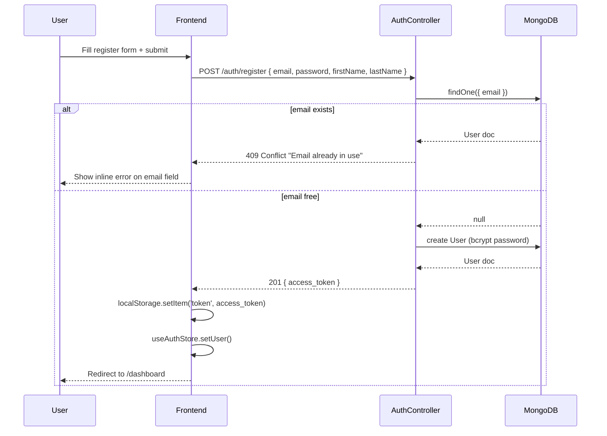
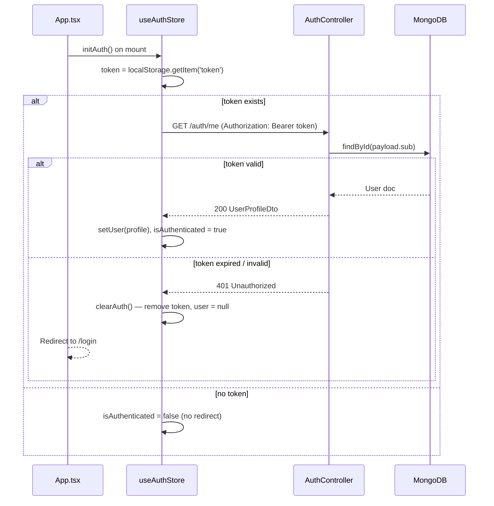
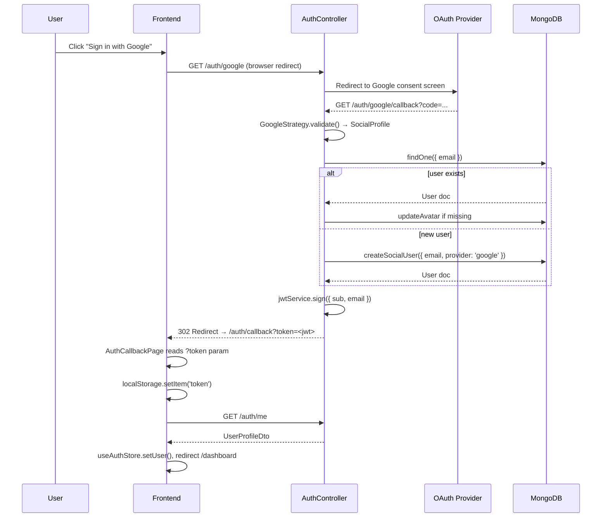

# Design Document: Authentication & Session Management

## Overview

This feature covers the complete authentication lifecycle for the wardrobe app: JWT-based email/password registration and login with duplicate-email detection, session persistence via `GET /auth/me` on page reload, and SSO via Google and Facebook OAuth using Passport.js strategies with automatic account linking by email. The frontend manages auth state through a Zustand store, attaches Bearer tokens via an Axios interceptor, and guards protected routes from unauthenticated access.

The backend is already partially implemented (`AuthModule`, `AuthController`, `AuthService`, Passport strategies). This spec formalises the complete contract, identifies gaps, and defines the frontend integration layer that does not yet exist.

---

## Architecture

```mermaid
graph TD
    subgraph Frontend
        A[LoginPage] --> B[useAuthStore Zustand]
        C[RegisterPage] --> B
        D[AuthCallbackPage] --> B
        B --> E[Orval Generated Hooks]
        F[ProtectedRoute] --> B
        G[AxiosInterceptor] --> B
    end

    subgraph Backend - AuthModule
        H[AuthController] --> I[AuthService]
        I --> J[UsersService]
        I --> K[JwtService]
        L[JwtStrategy] --> J
        M[GoogleStrategy] --> I
        N[FacebookStrategy] --> I
        J --> O[(MongoDB - users)]
    end

    Frontend -->|REST / JWT Bearer| Backend - AuthModule
    A -->|POST /auth/login| H
    C -->|POST /auth/register| H
    B -->|GET /auth/me| H
    A -->|GET /auth/google| H
    A -->|GET /auth/facebook| H
```

---

## Sequence Diagrams

### JWT Register & Login



### Session Persistence (F5 / Reload)



### Google / Facebook OAuth Flow



---

## Components and Interfaces

### Backend

#### AuthController — `/auth`

| Method | Endpoint | Guard | Description |
|--------|----------|-------|-------------|
| POST | `/auth/register` | — | Register with email/password; 409 on duplicate |
| POST | `/auth/login` | — | Login; 401 on bad credentials |
| GET | `/auth/me` | JwtAuthGuard | Return current user profile from token |
| GET | `/auth/google` | AuthGuard('google') | Redirect to Google consent |
| GET | `/auth/google/callback` | AuthGuard('google') | Handle Google callback → JWT redirect |
| GET | `/auth/facebook` | AuthGuard('facebook') | Redirect to Facebook consent |
| GET | `/auth/facebook/callback` | AuthGuard('facebook') | Handle Facebook callback → JWT redirect |

#### AuthService

```typescript
interface AuthService {
  register(dto: RegisterDto): Promise<AuthResponseDto>           // 409 if email exists
  login(dto: LoginDto): Promise<AuthResponseDto>                 // 401 if invalid
  getMe(userId: string): Promise<User>                           // 404 if not found
  validateSocialLogin(profile: SocialProfile): Promise<AuthResponseDto>  // upsert by email
}
```

#### Passport Strategies

| Strategy | Package | Scope / Fields |
|----------|---------|----------------|
| JwtStrategy | `passport-jwt` | `ExtractJwt.fromAuthHeaderAsBearerToken()` |
| GoogleStrategy | `passport-google-oauth20` | `['email', 'profile']` |
| FacebookStrategy | `passport-facebook` | `['email']`, profileFields: id, emails, name, picture |

### Frontend

#### Pages

| Component | Route | Description |
|-----------|-------|-------------|
| `LoginPage` | `/login` | Email/password form + Google/Facebook buttons |
| `RegisterPage` | `/register` | Registration form with real-time email check |
| `AuthCallbackPage` | `/auth/callback` | Reads `?token` from URL, stores it, redirects |

#### Components

| Component | Props | Description |
|-----------|-------|-------------|
| `ProtectedRoute` | `{ children: ReactNode }` | Redirects to `/login` if not authenticated |
| `SocialLoginButtons` | `{ onGoogleClick, onFacebookClick }` | Branded OAuth buttons |
| `EmailField` | `{ onBlur, error }` | Input with real-time 409 check on blur |

#### Zustand Store: `useAuthStore`

```typescript
interface AuthState {
  user: UserProfileDto | null
  isAuthenticated: boolean
  isLoading: boolean
  initAuth: () => Promise<void>       // called on App mount — checks /auth/me
  setUser: (user: UserProfileDto) => void
  clearAuth: () => void               // removes token + resets state
}
```

---

## Data Models

### User Schema (existing — `user.schema.ts`)

```typescript
interface User {
  _id: ObjectId
  email: string                              // unique, required
  password: string                           // bcrypt hash; random for social users
  firstName?: string
  lastName?: string
  phone?: string
  dateOfBirth?: Date
  bio?: string
  avatarUrl?: string
  measurements?: BodyMeasurements
  stylePreferences?: StylePreferences
  isActive: boolean                          // default: true
  provider: 'local' | 'google' | 'facebook' // default: 'local'
  createdAt: Date
  updatedAt: Date
}
```

No schema changes required. The `provider` field already exists.

### DTOs

**RegisterDto**
```typescript
class RegisterDto {
  @IsEmail() email: string
  @IsString() @MinLength(6) password: string
  @IsString() @IsNotEmpty() firstName: string
  @IsString() @IsNotEmpty() lastName: string
}
```

**LoginDto**
```typescript
class LoginDto {
  @IsEmail() email: string
  @IsString() @MinLength(6) password: string
}
```

**AuthResponseDto**
```typescript
class AuthResponseDto {
  access_token: string   // JWT
}
```

**UserProfileDto**
```typescript
class UserProfileDto {
  _id: string
  email: string
  firstName?: string
  lastName?: string
  phone?: string
  avatarUrl?: string
  bio?: string
  isActive: boolean
  provider: 'local' | 'google' | 'facebook'
}
```

---

## Error Handling

### Duplicate Email on Register
- Condition: `POST /auth/register` with an email already in `users` collection
- Response: `409 ConflictException` — `{ message: 'Email already in use' }`
- Frontend: Show inline error under email field; do not clear the field

### Invalid Credentials on Login
- Condition: Email not found or bcrypt compare fails
- Response: `401 UnauthorizedException` — `{ message: 'Invalid credentials' }`
- Frontend: Show banner error; do not reveal which field is wrong

### Expired / Invalid JWT on `/auth/me`
- Condition: Token missing, malformed, or past `exp`
- Response: `401 Unauthorized`
- Frontend: `clearAuth()` → remove token from localStorage → redirect `/login`

### OAuth Email Not Returned
- Condition: User denies email permission on Google/Facebook
- Response: `401 UnauthorizedException` — `{ message: 'No email returned from google. Please grant email permission.' }`
- Frontend: Redirect to `/login?error=oauth_no_email`

### OAuth Callback Token Missing
- Condition: `/auth/callback` page loaded without `?token` param
- Frontend: Redirect to `/login?error=oauth_failed`

---

## Testing Strategy

### Unit Testing
- `AuthService.register`: mock `UsersService.findByEmail` returning existing user → expect `ConflictException`
- `AuthService.login`: mock wrong password → expect `UnauthorizedException`
- `AuthService.validateSocialLogin`: mock no existing user → expect `createSocialUser` called; mock existing user → expect `createSocialUser` NOT called
- `JwtStrategy.validate`: mock `UsersService.findById` returning null → expect `UnauthorizedException`

### Property-Based Testing
- Library: `fast-check`
- Property: For any valid `RegisterDto`, if `findByEmail` returns a non-null user, `register()` always throws `ConflictException`
- Property: For any `LoginDto` where `bcrypt.compare` returns `false`, `login()` always throws `UnauthorizedException`

### Integration Testing
- `POST /auth/register` twice with same email → second call returns 409
- `POST /auth/login` with correct credentials → returns `{ access_token: string }`
- `GET /auth/me` with valid token → returns `UserProfileDto`
- `GET /auth/me` with expired token → returns 401
- `GET /auth/google` → returns 302 redirect

---

## Security Considerations

- Passwords are hashed with `bcryptjs` (salt rounds: 10) — never stored in plaintext
- Social users receive a random bcrypt hash as password — cannot be used for local login
- JWT secret loaded from `JWT_SECRET` env var — never hardcoded
- JWT expiry configured via `JWT_EXPIRES_IN` env var (default: `7d`)
- OAuth credentials (`GOOGLE_CLIENT_ID`, `FACEBOOK_APP_ID`, etc.) loaded from env — never committed
- `GET /auth/me` always re-validates the user exists in DB (not just token validity)
- CORS is enabled globally in `main.ts`; `FRONTEND_URL` env var controls OAuth redirect target
- Tokens stored in `localStorage` (acceptable for this app tier); `httpOnly` cookie upgrade is a future consideration

---

## Environment Variables

```env
# JWT
JWT_SECRET=your_super_secret_key
JWT_EXPIRES_IN=7d

# Google OAuth
GOOGLE_CLIENT_ID=your_google_client_id
GOOGLE_CLIENT_SECRET=your_google_client_secret
GOOGLE_CALLBACK_URL=http://localhost:3000/auth/google/callback

# Facebook OAuth
FACEBOOK_APP_ID=your_facebook_app_id
FACEBOOK_APP_SECRET=your_facebook_app_secret
FACEBOOK_CALLBACK_URL=http://localhost:3000/auth/facebook/callback

# Frontend (used by backend for OAuth redirect)
FRONTEND_URL=http://localhost:5173
```

---

## Dependencies

All dependencies are already installed:
- `@nestjs/passport`, `passport`, `passport-jwt`, `passport-google-oauth20`, `passport-facebook`
- `@nestjs/jwt`, `bcryptjs`
- `class-validator`, `class-transformer`, `@nestjs/swagger`
- Frontend: Orval (generates hooks from Swagger), Zustand, React Router v6, Axios
