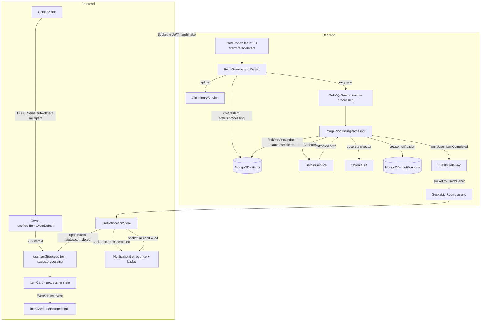
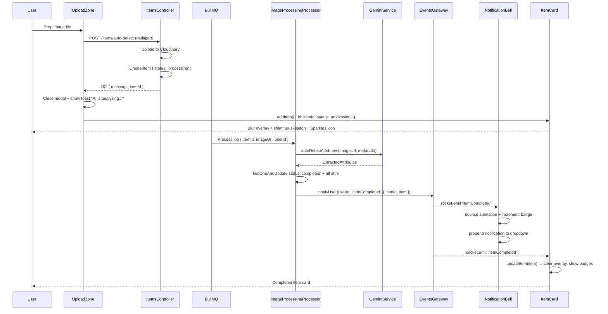
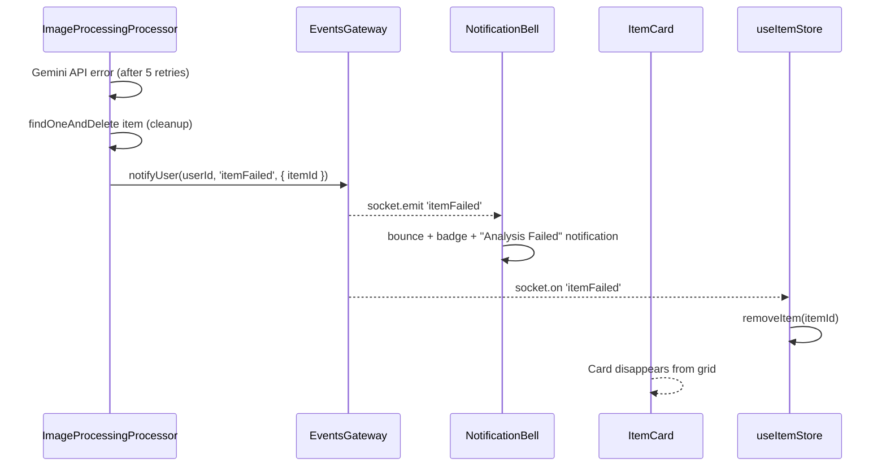
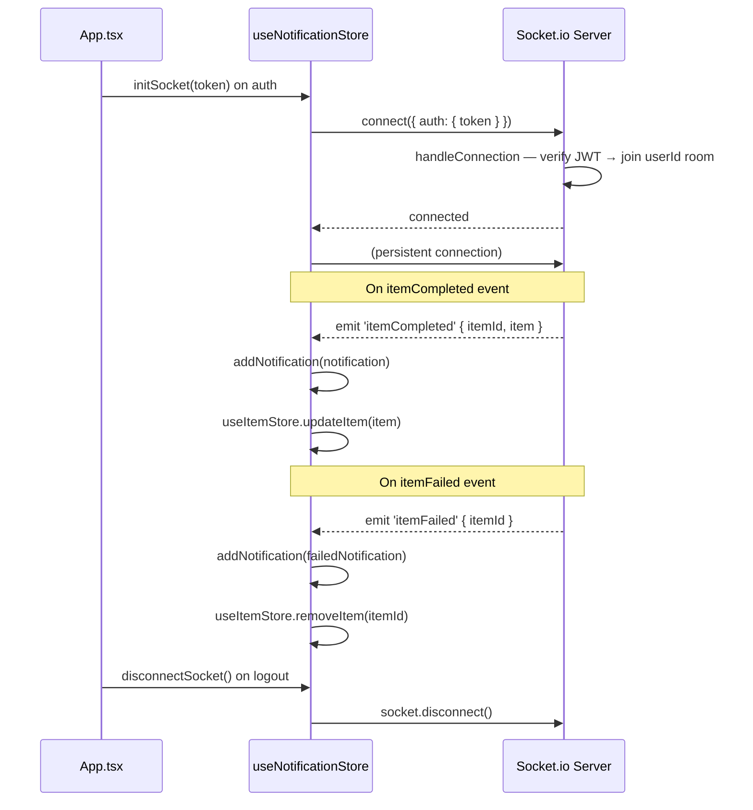

# Design Document: AI Auto-Detect Items

## Overview

This feature enables users to upload a clothing image and have the AI (Gemini Vision API) automatically extract all wardrobe attributes (name, category, color, style, occasion, brand, season, neckline, sleeve length, shoulder, size) in the background — without blocking the UI. The backend immediately acknowledges the upload with HTTP 202, enqueues a BullMQ job, and notifies the user via WebSocket when processing completes or fails. The frontend reflects real-time state transitions on `ItemCard` components and surfaces notifications through a `NotificationBell` in the nav bar.

The backend pipeline (`POST /items/auto-detect`, `ImageProcessingProcessor`, `EventsGateway`, `NotificationsModule`) is already fully implemented. This spec covers the frontend integration layer, the WebSocket connection lifecycle, and the real-time UI state machine for item cards.

---

## Architecture



---

## Sequence Diagrams

### Happy Path: Upload → AI Analysis → Real-time Update



### Failure Path: AI Analysis Fails



### WebSocket Connection Lifecycle



---

## Components and Interfaces

### Backend (all existing — no changes required)

#### `POST /items/auto-detect`

**Purpose**: Accept image upload, create processing item, enqueue BullMQ job, return 202 immediately.

**Interface**:
```typescript
// Request: multipart/form-data
// Field: file (binary image)
// Response: 202
interface AutoDetectResponseDto {
  message: string   // 'Image queued for processing'
  itemId: string    // MongoDB ObjectId of the created item
}
```

**Responsibilities**:
- Upload image to Cloudinary synchronously
- Create `Item` document with `status: 'processing'`, `name: 'Analyzing...'`
- Enqueue `detect-clothing` job with `{ itemId, imageUrl, userId }` — 5 attempts, exponential backoff
- Return 202 without waiting for AI result

#### `ImageProcessingProcessor` (BullMQ Worker)

**Purpose**: Background worker that calls Gemini, updates item, notifies user.

**Interface**:
```typescript
interface DetectClothingJob {
  itemId: string
  imageUrl: string
  userId: string
}
```

**Responsibilities**:
- Load all metadata from MongoDB (categories, styles, occasions, etc.)
- Call `GeminiService.autoDetectAttributes(imageUrl, metadataLists)`
- Resolve or create metadata documents via `getOrCreateMetadata()`
- `findOneAndUpdate` item with `status: 'completed'` + all extracted fields
- Upsert item vector to ChromaDB
- Create `ITEM_PROCESSED` notification in MongoDB
- Emit `itemCompleted` WebSocket event to user room
- On failure: delete item, create `ITEM_FAILED` notification, emit `itemFailed` event

#### `EventsGateway` (Socket.io)

**Purpose**: Real-time bidirectional channel; routes events to per-user rooms.

**Interface**:
```typescript
interface EventsGateway {
  notifyUser(userId: string, eventName: 'itemCompleted' | 'itemFailed', data: ItemCompletedPayload | ItemFailedPayload): void
}

interface ItemCompletedPayload {
  itemId: string
  item: ItemDocument   // fully populated item
}

interface ItemFailedPayload {
  itemId: string
}
```

**Responsibilities**:
- On `handleConnection`: extract JWT from `handshake.headers.authorization`, verify, join `userId` room
- On `handleDisconnect`: log disconnection
- `notifyUser`: emit to `server.to(userId)` room

#### `NotificationsController`

| Method | Endpoint | Description |
|--------|----------|-------------|
| GET | `/notifications` | Fetch last 50 notifications for current user, sorted by `createdAt` desc |
| PATCH | `/notifications/:id/read` | Toggle `isRead` on a notification |

### Frontend (new)

#### `useNotificationStore` (Zustand)

**Purpose**: Manages WebSocket connection lifecycle, notification list, unread count.

**Interface**:
```typescript
interface NotificationState {
  notifications: NotificationDto[]
  unreadCount: number
  socket: Socket | null
  isConnected: boolean
  initSocket: (token: string) => void
  disconnectSocket: () => void
  addNotification: (n: NotificationDto) => void
  setNotifications: (ns: NotificationDto[]) => void
  markRead: (id: string) => void
  clearUnread: () => void
}
```

#### `NotificationBell`

**Purpose**: Nav bar bell icon with real-time badge and notification dropdown.

**Interface**:
```typescript
interface NotificationBellProps {
  // no props — reads from useNotificationStore directly
}
```

**Responsibilities**:
- Show red badge with `unreadCount` when > 0
- Trigger CSS bounce animation on new notification arrival
- Toggle dropdown on click; call `clearUnread()` on open
- Render notification list from store; each item shows title, message, relative time
- Click notification → navigate to `notification.linkTarget`; call `markRead(id)` via Orval hook

#### `UploadZone`

**Purpose**: Drag-and-drop image upload that triggers auto-detect flow.

**Interface**:
```typescript
interface UploadZoneProps {
  onClose: () => void   // called immediately after 202 response
}
```

**Responsibilities**:
- Accept drag-and-drop or click-to-browse (image/* only)
- On submit: disable button, call `usePostItemsAutoDetect()` Orval hook
- On 202: call `onClose()` + show toast "AI is analyzing your item..."
- Add `{ _id: itemId, status: 'processing', name: 'Analyzing...' }` to `useItemStore`
- Never block UI — no loading spinner that prevents other interactions

#### `ItemCard`

**Purpose**: Display a single wardrobe item with status-aware rendering.

**Interface**:
```typescript
interface ItemCardProps {
  item: ItemResponseDto
}
```

**State Behaviours**:
- `status === 'processing'`: blur overlay (`backdrop-blur-sm bg-white/30`) + shimmer gradient + `Sparkles` icon (lucide-react) + hide action buttons
- `status === 'completed'`: clear image + item name + category badge + location badge + edit/delete/favorite buttons
- `status === 'failed'`: error overlay — this state is transient (item is deleted on failure); card is removed from store via `removeItem(itemId)`
- Real-time transition: `useNotificationStore` WebSocket handler calls `useItemStore.updateItem(item)` → React re-renders card without page reload

---

## Data Models

### Item Schema (existing — `item.schema.ts`)

No schema changes. The `status` field already exists:

```typescript
@Prop({
  type: String,
  enum: ['processing', 'completed', 'failed'],
  default: 'completed',
})
status: string;
```

Key fields populated by `ImageProcessingProcessor` on completion:
- `name`, `color` — string
- `category`, `style`, `occasion`, `brand`, `seasonCode`, `sleeveLength`, `neckline`, `shoulder`, `size` — ObjectId refs (resolved or created via `getOrCreateMetadata`)
- `images[]` — Cloudinary URL (set at creation time)

### Notification Schema (existing — `notification.schema.ts`)

```typescript
enum NotificationType {
  ITEM_PROCESSED = 'ITEM_PROCESSED',
  ITEM_FAILED = 'ITEM_FAILED',
  INFO = 'INFO',
}

interface Notification {
  _id: ObjectId
  user: ObjectId          // ref: User
  type: NotificationType
  title: string
  message: string
  isRead: boolean         // default: false
  linkTarget?: string     // e.g. '/item/64a1b2c3...'
  createdAt: Date
  updatedAt: Date
}
```

### Frontend Types

```typescript
// Orval-generated from Swagger
interface NotificationDto {
  _id: string
  type: string
  title: string
  message: string
  isRead: boolean
  linkTarget?: string
  createdAt: string
}

// WebSocket event payloads (manual types — not from Orval)
interface ItemCompletedEvent {
  itemId: string
  item: ItemResponseDto
}

interface ItemFailedEvent {
  itemId: string
}
```

---

## Error Handling

### Upload Fails (Cloudinary error)
- Condition: `POST /items/auto-detect` throws before returning 202
- Response: `500` or `400`
- Frontend: Show toast error "Upload failed. Please try again."; re-enable upload button

### AI Analysis Fails (Gemini error after 5 retries)
- Condition: `ImageProcessingProcessor` exhausts all retry attempts
- Backend: Deletes the item document; creates `ITEM_FAILED` notification; emits `itemFailed` WebSocket event
- Frontend: `useNotificationStore` receives `itemFailed` → calls `useItemStore.removeItem(itemId)` → card disappears; `NotificationBell` shows "Image Analysis Failed" notification

### WebSocket Disconnection
- Condition: Network interruption or server restart
- Frontend: Socket.io client auto-reconnects with exponential backoff
- Missed events: On reconnect, call `useGetNotifications()` to re-sync notification list from REST API

### No File Provided
- Condition: `POST /items/auto-detect` called without a file
- Response: `404 No file provided`
- Frontend: Validate file presence before calling hook; show inline error in `UploadZone`

### JWT Expired on WebSocket Connect
- Condition: Token expired when Socket.io handshake is attempted
- Backend: `EventsGateway.handleConnection` catches JWT verify error → `client.disconnect()`
- Frontend: Socket `connect_error` event → `useNotificationStore` sets `isConnected: false`; user must re-login

---

## Testing Strategy

### Unit Testing

- `ImageProcessingProcessor.process()`: mock `GeminiService.autoDetectAttributes` returning valid attrs → assert `itemModel.findOneAndUpdate` called with `status: 'completed'`
- `ImageProcessingProcessor.process()`: mock Gemini throwing → assert `itemModel.findOneAndDelete` called + `eventsGateway.notifyUser` called with `'itemFailed'`
- `EventsGateway.handleConnection()`: mock valid JWT → assert `client.join(userId)` called
- `EventsGateway.handleConnection()`: mock invalid JWT → assert `client.disconnect()` called
- `NotificationsService.create()`: assert notification saved with correct `type`, `user`, `linkTarget`

### Property-Based Testing

**Library**: `fast-check`

- Property: For any valid `imageUrl` and `userId`, if `GeminiService.autoDetectAttributes` returns a non-null result, `process()` always sets `status: 'completed'` and calls `notifyUser` with `'itemCompleted'`
- Property: For any `itemId`, if `process()` throws, `notifyUser` is always called with `'itemFailed'` (never silently swallowed)

### Integration Testing

- `POST /items/auto-detect` with valid image → `202 { message, itemId }`; item in DB has `status: 'processing'`
- `POST /items/auto-detect` without file → `404`
- `GET /notifications` with valid token → returns array of `NotificationDto`
- `PATCH /notifications/:id/read` → `isRead` toggled in DB
- WebSocket connect with valid JWT → client joins userId room
- WebSocket connect with invalid JWT → connection rejected

### Frontend Testing

- `UploadZone`: mock `usePostItemsAutoDetect` returning 202 → assert `onClose()` called + toast shown
- `NotificationBell`: mock store with `unreadCount: 3` → assert badge renders "3"
- `ItemCard` with `status: 'processing'` → assert shimmer overlay rendered, action buttons absent
- `ItemCard` with `status: 'completed'` → assert image visible, badges rendered

---

## Security Considerations

- WebSocket connections require a valid JWT in `handshake.headers.authorization` — unauthenticated clients are immediately disconnected
- `notifyUser` routes events to a per-user room (`userId`) — users cannot receive other users' item events
- Cloudinary upload is server-side only — the client never receives Cloudinary credentials
- BullMQ job data contains only `itemId`, `imageUrl`, `userId` — no sensitive user data in the queue
- Notification `linkTarget` is a relative path (e.g. `/item/:id`) — no open redirect risk

---

## Dependencies

All dependencies are already installed:

**Backend**:
- `@nestjs/bullmq`, `bullmq` — job queue
- `@google/generative-ai` — Gemini Vision API via `GeminiService`
- `@nestjs/websockets`, `socket.io` — WebSocket gateway
- `cloudinary` — image hosting via `CloudinaryService`
- `@nestjs/mongoose`, `mongoose` — MongoDB

**Frontend**:
- `socket.io-client` — WebSocket connection
- `zustand` — `useNotificationStore`, `useItemStore`
- Orval-generated hooks — `usePostItemsAutoDetect`, `useGetNotifications`, `usePatchNotificationsIdRead`
- `lucide-react` — `Sparkles`, `Bell` icons
- `react-hot-toast` or existing toast utility — upload acknowledgement toast
