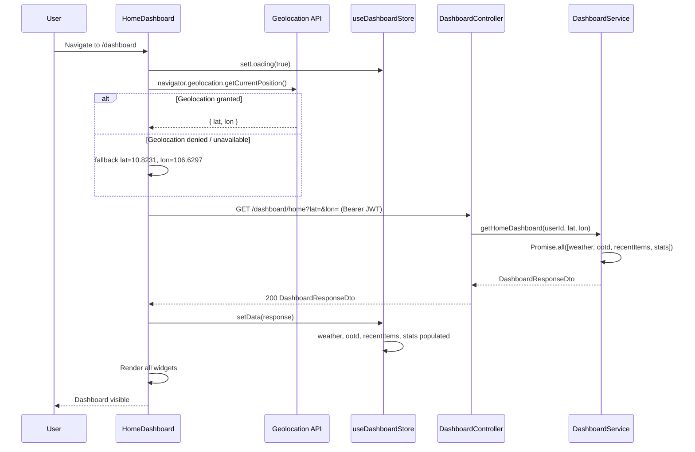
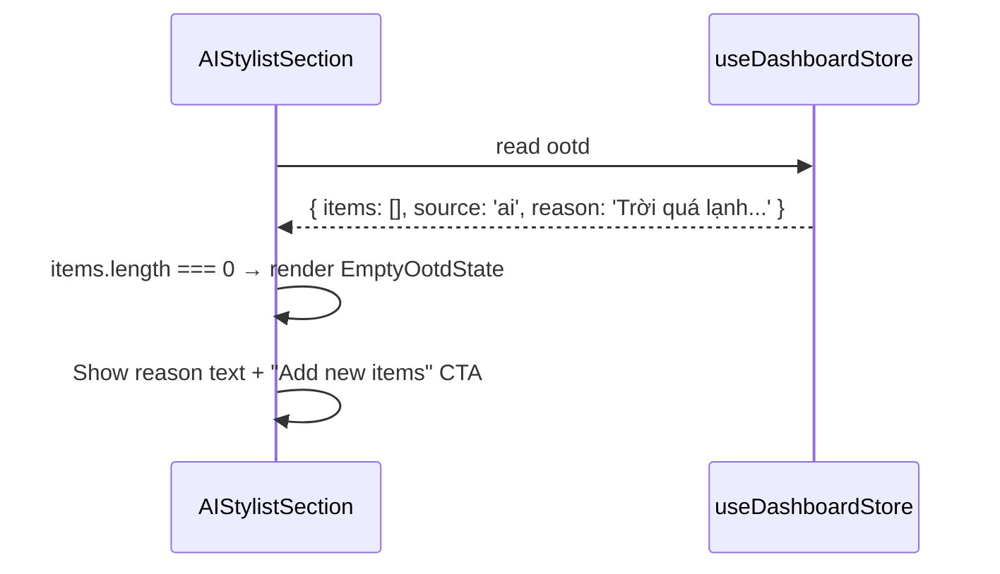

# Design Document: Home Dashboard

## Overview

The Home Dashboard is the main landing page of the wardrobe app after login. It acts as a Backend-for-Frontend (BFF) aggregator: a single `GET /dashboard/home` endpoint fetches weather data (cached 30 min via OpenWeatherMap), an AI-powered Outfit of the Day (OOTD) recommendation via the RAG pipeline (ChromaDB + Gemini), the user's 5 most recently added items, and wardrobe aggregate stats — all in parallel — and returns them in one response.

The backend module is fully implemented and Swagger-complete. This spec covers the frontend integration layer: the `HomeDashboard` page, its sub-components, the `useDashboardStore` Zustand store, and the Orval-generated hook wiring.

---

## Architecture

```mermaid
graph TD
    subgraph Frontend
        A[HomeDashboard Page] --> B[useDashboardStore - Zustand]
        B --> C[Orval: useGetDashboardHome]
        A --> D[WeatherWidget]
        A --> E[AIStylistSection]
        A --> F[RecentItemsRow]
        A --> G[WardrobeStatsWidget]
        E --> H[OutfitCard]
        E --> I[SkeletonCard]
        A --> J[Geolocation API]
    end

    subgraph Backend - DashboardModule
        K[DashboardController] --> L[DashboardService]
        L --> M[WeatherService - cached 30min]
        L --> N[RecommendationService - RAG]
        L --> O[(MongoDB - items)]
        M --> P[OpenWeatherMap API]
        N --> Q[ChromaDB]
        N --> R[Gemini AI]
    end

    Frontend -->|GET /dashboard/home?lat=&lon= Bearer JWT| Backend - DashboardModule
```

---

## Sequence Diagrams

### Page Load — Happy Path



### OOTD Empty State (AI Refusal)



---

## Components and Interfaces

### Backend

#### DashboardController — `/dashboard` (fully implemented, no changes)

| Method | Endpoint | Guard | Description |
|--------|----------|-------|-------------|
| GET | `/dashboard/home` | JwtAuthGuard | BFF aggregator — weather + OOTD + recentItems + stats |

Query params: `lat` (float, default 10.8231), `lon` (float, default 106.6297)

#### DashboardService (fully implemented)

```typescript
interface DashboardService {
  getHomeDashboard(userId: string, lat: number, lon: number): Promise<DashboardResponseDto>
  // Internally: Promise.all([weather, ootd, recentItems, stats])
}
```

### Frontend

#### Pages

| Component | Route | Description |
|-----------|-------|-------------|
| `HomeDashboard` | `/dashboard` | Main dashboard page — orchestrates all widgets |

#### Components

| Component | Props | Description |
|-----------|-------|-------------|
| `WeatherWidget` | `{ weather: WeatherResponseDto }` | Location, temperature, weather icon |
| `AIStylistSection` | `{ ootd: OotdResponseDto \| null, isLoading: boolean }` | OOTD section with loading/success/empty states |
| `OutfitCard` | `{ item: OotdItemDto }` | Single OOTD item card with image, name, category |
| `SkeletonCard` | `{}` | Shimmering placeholder card for loading state |
| `RecentItemsRow` | `{ items: RecentItemDto[] }` | Horizontal scroll row of recent items |
| `WardrobeStatsWidget` | `{ stats: WardrobeStatsDto }` | Total items count + total value display |

#### Zustand Store: `useDashboardStore`

```typescript
interface DashboardState {
  weather: WeatherResponseDto | null
  ootd: OotdResponseDto | null
  recentItems: RecentItemDto[]
  stats: WardrobeStatsDto | null
  isLoading: boolean
  error: string | null
  setData: (data: DashboardResponseDto) => void
  setLoading: (loading: boolean) => void
  setError: (error: string | null) => void
  reset: () => void
}
```

---

## Data Models

### DTOs (backend — fully implemented, Swagger-complete)

**WeatherResponseDto**
```typescript
class WeatherResponseDto {
  temperature: number       // Celsius
  feelsLike: number         // Celsius
  humidity: number          // percentage
  iconCode: string          // OpenWeatherMap icon code e.g. "10d"
  iconUrl: string           // full OWM icon URL
  condition: string         // e.g. "Rain", "Clear"
  description: string       // e.g. "moderate rain"
  cityName: string          // resolved from coordinates
}
```

**OotdItemDto**
```typescript
class OotdItemDto {
  _id: string
  name: string
  category: string
  color: string
  images: string[]
}
```

**OotdResponseDto**
```typescript
class OotdResponseDto {
  items: OotdItemDto[]
  source: 'ai' | 'fallback'
  reason?: string
}
```

**RecentItemDto**
```typescript
class RecentItemDto {
  _id: string
  name: string
  category: string
  color: string
  images: string[]
  createdAt: string
}
```

**WardrobeStatsDto**
```typescript
class WardrobeStatsDto {
  totalItems: number
  totalValue: number
}
```

**DashboardResponseDto**
```typescript
class DashboardResponseDto {
  weather: WeatherResponseDto
  ootd: OotdResponseDto
  recentItems: RecentItemDto[]
  stats: WardrobeStatsDto
}
```

---

## Frontend Component Design

### `HomeDashboard` — layout structure

```
/dashboard
├── Header: greeting ("Good morning, [firstName]!") + WeatherWidget
├── AIStylistSection
│   ├── [loading]  → 3× SkeletonCard in horizontal row
│   ├── [items > 0] → AI badge + reason quote box + horizontal OutfitCard grid
│   └── [items = 0] → AI reason text + "Add new items" CTA button
├── RecentItemsRow (horizontal scroll)
└── WardrobeStatsWidget (total items + total value)
```

### Weather Icon Mapping (lucide-react)

| OWM `condition` | Icon |
|-----------------|------|
| `Clear` | `Sun` |
| `Clouds` | `Cloud` |
| `Rain`, `Drizzle` | `CloudRain` |
| `Thunderstorm` | `CloudLightning` |
| `Snow` | `Snowflake` |
| `Mist`, `Fog`, `Haze` | `CloudFog` |
| fallback | `Thermometer` |

### Geolocation Strategy

```typescript
// On mount, attempt browser geolocation with 5s timeout
// On success: use { lat, lon } from position.coords
// On error / timeout: fallback to Ho Chi Minh City { lat: 10.8231, lon: 106.6297 }
// Then fire the Orval hook with the resolved coordinates
```

### `useDashboardStore` — Zustand

```typescript
import { create } from 'zustand'
import {
  DashboardResponseDto,
  WeatherResponseDto,
  OotdResponseDto,
  RecentItemDto,
  WardrobeStatsDto,
} from '@/api/generated'

interface DashboardState {
  weather: WeatherResponseDto | null
  ootd: OotdResponseDto | null
  recentItems: RecentItemDto[]
  stats: WardrobeStatsDto | null
  isLoading: boolean
  error: string | null
  setData: (data: DashboardResponseDto) => void
  setLoading: (loading: boolean) => void
  setError: (error: string | null) => void
  reset: () => void
}

export const useDashboardStore = create<DashboardState>((set) => ({
  weather: null,
  ootd: null,
  recentItems: [],
  stats: null,
  isLoading: true,
  error: null,
  setData: (data) => set({ ...data, isLoading: false, error: null }),
  setLoading: (isLoading) => set({ isLoading }),
  setError: (error) => set({ error, isLoading: false }),
  reset: () => set({ weather: null, ootd: null, recentItems: [], stats: null, isLoading: true, error: null }),
}))
```

### `HomeDashboard.tsx` — orchestration pattern

```typescript
// Route: /dashboard (ProtectedRoute)
// 1. On mount: resolve coordinates via Geolocation API (with fallback)
// 2. Pass coords as enabled query params to Orval hook useGetDashboardHome({ lat, lon })
// 3. On data: call store.setData(data)
// 4. On error: call store.setError(message)
// 5. Render widgets from store state

export function HomeDashboard() {
  const { user } = useAuthStore()
  const store = useDashboardStore()
  const [coords, setCoords] = useState<{ lat: number; lon: number } | null>(null)

  // Step 1: Geolocation
  useEffect(() => {
    navigator.geolocation.getCurrentPosition(
      (pos) => setCoords({ lat: pos.coords.latitude, lon: pos.coords.longitude }),
      () => setCoords({ lat: 10.8231, lon: 106.6297 }),  // fallback: HCMC
      { timeout: 5000 },
    )
  }, [])

  // Step 2: Orval hook — only fires once coords are resolved
  const { data, isLoading, error } = useGetDashboardHome(
    { lat: coords?.lat ?? 10.8231, lon: coords?.lon ?? 106.6297 },
    { query: { enabled: coords !== null } },
  )

  // Step 3 & 4: Sync to store
  useEffect(() => {
    if (data) store.setData(data)
  }, [data])

  useEffect(() => {
    if (error) store.setError('Failed to load dashboard')
  }, [error])

  return (
    <div className="min-h-screen bg-gray-50 p-4 space-y-6">
      {/* Header */}
      <header className="flex items-center justify-between">
        <h1 className="text-2xl font-semibold text-gray-900">
          Good {getTimeOfDay()}, {user?.firstName ?? 'there'}
        </h1>
        {store.weather && <WeatherWidget weather={store.weather} />}
      </header>

      {/* AI Stylist */}
      <AIStylistSection ootd={store.ootd} isLoading={isLoading ?? store.isLoading} />

      {/* Recent Items */}
      {store.recentItems.length > 0 && <RecentItemsRow items={store.recentItems} />}

      {/* Stats */}
      {store.stats && <WardrobeStatsWidget stats={store.stats} />}
    </div>
  )
}
```

---

## Error Handling

### Geolocation Denied / Unavailable
- Condition: `navigator.geolocation` not available or user denies permission
- Frontend: Silently fall back to Ho Chi Minh City coordinates `{ lat: 10.8231, lon: 106.6297 }`
- No error shown to user — fallback is transparent

### Dashboard API Error (non-401)
- Condition: `GET /dashboard/home` returns 5xx or network failure
- Frontend: `store.setError('Failed to load dashboard')` — show inline error banner with retry button
- Retry: reset store, re-trigger hook by toggling `coords` state

### Unauthorized (401)
- Condition: JWT expired or missing
- Frontend: Handled globally by the Axios interceptor in `api.ts` — redirects to `/login`

### OOTD Empty Items
- Condition: `ootd.items.length === 0` (AI refused due to wardrobe gaps)
- Frontend: Not an error — render `EmptyOotdState` with `ootd.reason` text and CTA button

---

## Testing Strategy

### Unit Testing
- `useDashboardStore.setData`: given a full `DashboardResponseDto`, all fields are populated and `isLoading` becomes `false`
- `useDashboardStore.setError`: `error` is set and `isLoading` becomes `false`
- `WeatherWidget`: renders correct lucide icon for each `condition` value
- `AIStylistSection`: renders `SkeletonCard` when `isLoading=true`; renders `OutfitCard` grid when `items.length > 0`; renders `EmptyOotdState` when `items.length === 0`

### Property-Based Testing
- Library: `fast-check`
- Property: For any `WeatherResponseDto`, `WeatherWidget` always renders without throwing
- Property: For any `OotdResponseDto` with `items.length > 0`, `AIStylistSection` renders exactly `items.length` `OutfitCard` components

### Integration Testing
- `GET /dashboard/home` with valid JWT and valid coords → `200 DashboardResponseDto` with all 4 fields populated
- `GET /dashboard/home` without JWT → `401 Unauthorized`
- `GET /dashboard/home` with default coords (no lat/lon params) → `200` using HCMC fallback

---

## Security Considerations

- `GET /dashboard/home` is guarded by `JwtAuthGuard` — all data is scoped to the authenticated user's `_id` from the JWT
- Coordinates are passed as query params — no PII; lat/lon are not stored
- Weather cache key is `lat:lon` — no user data in cache key
- OOTD pipeline queries ChromaDB filtered by `userId` — no cross-user data leakage

---

## Performance Considerations

- Backend uses `Promise.all` for OOTD + recentItems + stats — parallel execution minimises latency
- Weather is cached for 30 minutes in-memory — repeated dashboard loads within the window skip the OpenWeatherMap API call
- Frontend defers the API call until geolocation resolves (or times out at 5s) — avoids a second request with corrected coords
- `SkeletonCard` shimmer animation provides perceived performance during the OOTD RAG pipeline latency

---

## Dependencies

All dependencies already installed:
- Backend: `@nestjs/mongoose`, `mongoose`, `@nestjs/swagger`, `class-validator`, `class-transformer`, `axios` (OpenWeatherMap), `@google/generative-ai` (Gemini), `chromadb`
- Frontend: Orval (generates hooks from Swagger), Zustand, React Router v6, Tailwind CSS, `lucide-react`
