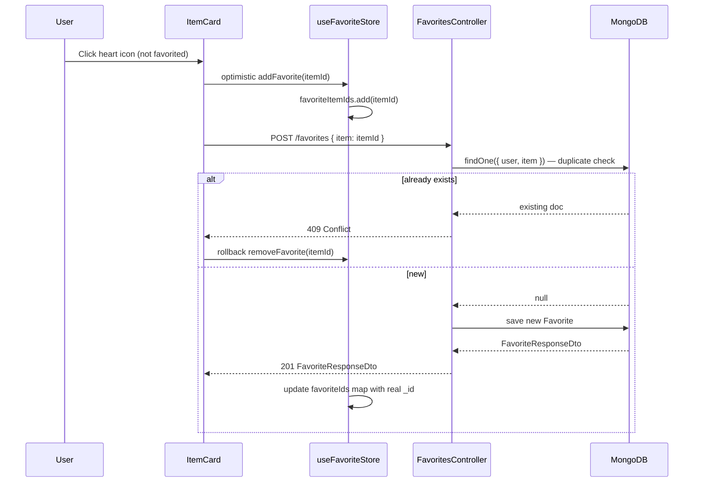
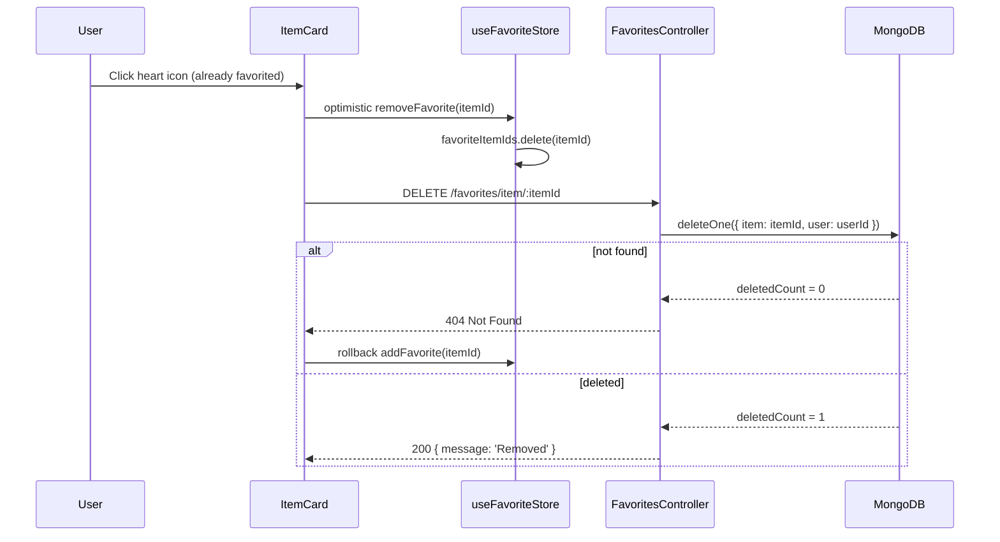
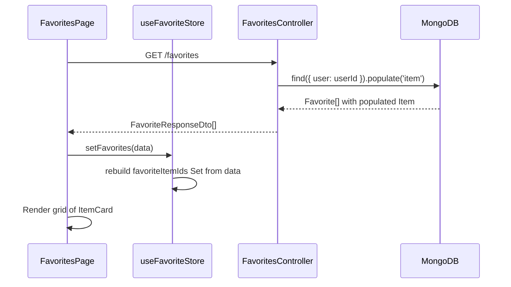

# Design Document: Favorites

## Overview

The Favorites feature lets authenticated users bookmark wardrobe items they want to keep track of. Each favorite is a lightweight join document (`user` + `item`) with a unique compound index preventing duplicates. The backend module already exists but is missing Swagger decorators (`@ApiOperation`, `@ApiResponse`) and a `FavoriteResponseDto` — both required for Orval to generate typed frontend hooks. The frontend needs a `FavoritesPage`, a heart-toggle on `ItemCard`, a Zustand store for O(1) lookup, and a sidebar link.

---

## Architecture

```mermaid
graph TD
    subgraph Frontend
        A[FavoritesPage] --> B[useFavoriteStore - Zustand]
        C[ItemCard - heart toggle] --> B
        B --> D[Orval Generated Hooks]
        E[Sidebar] --> A
    end

    subgraph Backend - FavoritesModule
        F[FavoritesController] --> G[FavoritesService]
        G --> H[(MongoDB - favorites)]
        G --> I[ItemsService - ownership check]
        H -->|populate| J[(MongoDB - items)]
    end

    Frontend -->|REST / JWT Bearer| Backend - FavoritesModule
    A -->|GET /favorites| F
    C -->|POST /favorites| F
    C -->|DELETE /favorites/item/:itemId| F
```

---

## Sequence Diagrams

### Toggle Favorite ON (add)



### Toggle Favorite OFF (remove)



### Load Favorites Page



---

## Components and Interfaces

### Backend

#### FavoritesController — `/favorites`

| Method | Endpoint | Guard | Description |
|--------|----------|-------|-------------|
| POST | `/favorites` | JwtAuthGuard | Add item to favorites; 409 if duplicate |
| GET | `/favorites` | JwtAuthGuard | Get all favorites for current user (item populated) |
| GET | `/favorites/:id` | JwtAuthGuard | Get single favorite by favorite doc `_id` |
| DELETE | `/favorites/item/:itemId` | JwtAuthGuard | Remove favorite by item ID — used for toggle |
| DELETE | `/favorites/:id` | JwtAuthGuard | Remove favorite by favorite doc `_id` |

#### FavoritesService

```typescript
interface FavoritesService {
  create(dto: CreateFavoriteDto, userId: string): Promise<Favorite>       // 409 if duplicate
  findAll(userId: string): Promise<Favorite[]>                            // populated item
  findOne(id: string, userId: string): Promise<Favorite>                  // 404 if not found
  removeByItemId(itemId: string, userId: string): Promise<void>           // 404 if not found
  remove(id: string, userId: string): Promise<void>                       // 404 if not found
}
```

### Frontend

#### Pages

| Component | Route | Description |
|-----------|-------|-------------|
| `FavoritesPage` | `/favorites` | Grid of favorited items using `ItemCard` |

#### Components

| Component | Props | Description |
|-----------|-------|-------------|
| `ItemCard` | `{ item, showHeart?: boolean }` | Existing card — add heart toggle |
| `HeartButton` | `{ itemId, size? }` | Standalone heart icon button; reads/writes `useFavoriteStore` |

#### Zustand Store: `useFavoriteStore`

```typescript
interface FavoriteState {
  favoriteItemIds: Set<string>          // O(1) lookup for heart state
  favorites: FavoriteResponseDto[]      // full list for FavoritesPage
  isLoading: boolean
  fetchFavorites: () => Promise<void>   // GET /favorites — populates both fields
  addFavorite: (itemId: string) => void // optimistic add
  removeFavorite: (itemId: string) => void // optimistic remove
  isFavorited: (itemId: string) => boolean // derived lookup
}
```

---

## Data Models

### Favorite Schema (existing — `favorite.schema.ts`)

```typescript
interface Favorite {
  _id: ObjectId
  user: ObjectId          // ref: User — required
  item: ObjectId | Item   // ref: Item — required; populated on GET
  createdAt: Date
  updatedAt: Date
}
// Unique compound index: { user: 1, item: 1 }
```

No schema changes required.

### DTOs

**CreateFavoriteDto** (existing — `favorites.dto.ts`)
```typescript
class CreateFavoriteDto {
  @ApiProperty({ example: '60d0fe4f5311236168a109ca', description: 'Item ID' })
  @IsString()
  @IsNotEmpty()
  item: string
}
```

**FavoriteResponseDto** (missing — must be created)
```typescript
class FavoriteResponseDto {
  @ApiProperty() _id: string
  @ApiProperty() item: ItemResponseDto    // populated item object
  @ApiProperty() createdAt: Date
}
```

> `ItemResponseDto` is the existing item response shape from `items.dto.ts`. Import and reuse it.

---

## Error Handling

### Duplicate Favorite
- Condition: `POST /favorites` with an `itemId` already favorited by this user
- Response: `409 ConflictException` — `{ message: 'Item is already in favorites' }`
- Frontend: Rollback optimistic update; heart returns to un-filled state

### Favorite Not Found on Delete
- Condition: `DELETE /favorites/item/:itemId` or `DELETE /favorites/:id` — doc doesn't exist or belongs to another user
- Response: `404 NotFoundException` — `{ message: 'Favorite not found' }`
- Frontend: Rollback optimistic update; heart returns to filled state

### Item Not Owned by User
- Condition: `POST /favorites` with an `itemId` that doesn't belong to the current user
- Response: `404 NotFoundException` (thrown by `ItemsService.findOne`)
- Frontend: Show toast error; no optimistic update applied

---

## Testing Strategy

### Unit Testing
- `FavoritesService.create`: mock `favoriteModel.findOne` returning existing doc → expect `ConflictException`
- `FavoritesService.create`: mock `itemsService.findOne` throwing `NotFoundException` → expect it to propagate
- `FavoritesService.removeByItemId`: mock `deleteOne` returning `{ deletedCount: 0 }` → expect `NotFoundException`
- `FavoritesService.findOne`: mock `findOne` returning null → expect `NotFoundException`

### Property-Based Testing
- Library: `fast-check`
- Property: For any valid `userId` and `itemId`, if a favorite already exists, `create()` always throws `ConflictException`
- Property: For any `userId`, `findAll()` always returns an array where every element's `user` equals `userId`

### Integration Testing
- `POST /favorites` twice with same item → second call returns 409
- `GET /favorites` → returns array with populated `item` field (not just ObjectId)
- `DELETE /favorites/item/:itemId` → subsequent `GET /favorites` no longer includes that item
- All endpoints without Bearer token → 401

---

## Security Considerations

- All endpoints require `JwtAuthGuard` — unauthenticated requests return 401
- `FavoritesService` always scopes queries by `userId` from the JWT — users cannot access or delete other users' favorites
- `create()` calls `ItemsService.findOne(itemId, userId)` before saving — prevents favoriting items the user doesn't own
- No sensitive data exposed; `FavoriteResponseDto` only returns `_id`, populated `item`, and `createdAt`

---

## Dependencies

All dependencies already installed:
- Backend: `@nestjs/mongoose`, `mongoose`, `class-validator`, `class-transformer`, `@nestjs/swagger`
- Frontend: Orval (generates hooks from Swagger), Zustand, React Router v6, Tailwind CSS
