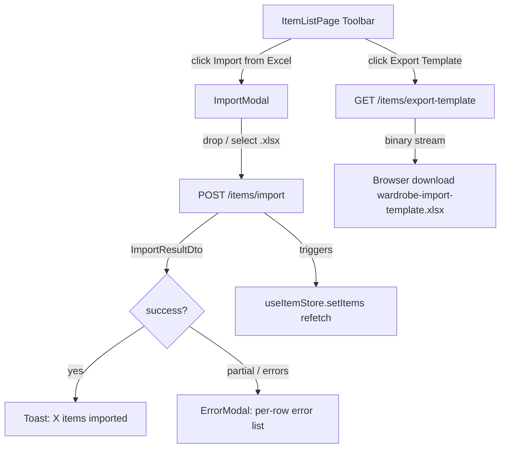
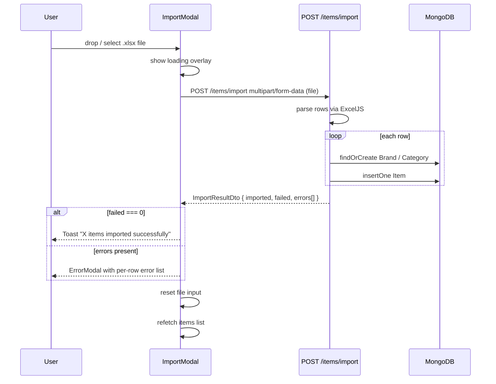

# Design Document: Bulk Import / Export Items

## Overview

This feature adds bulk data entry to the wardrobe app by exposing two toolbar actions on `ItemListPage`: downloading a pre-filled Excel template and uploading a completed file to import multiple items at once. Both backend endpoints already exist; this spec closes the Swagger/DTO gaps that block Orval generation and delivers the full frontend integration.

---

## Architecture



---

## Sequence Diagrams

### Export Template Flow

```mermaid
sequenceDiagram
    participant U as User
    participant FE as ItemListPage
    participant API as GET /items/export-template
    participant XLS as ExcelJS

    U->>FE: click "Export Template"
    FE->>API: GET /items/export-template (Bearer token)
    API->>XLS: build workbook (headers + 2 sample rows)
    XLS-->>API: Buffer
    API-->>FE: Content-Disposition: attachment; filename=wardrobe-import-template.xlsx
    FE-->>U: browser triggers file download
```

### Import Flow



---

## Components and Interfaces

### Backend: `ImportResultDto`

**Purpose**: Typed response for `POST /items/import` — required for Orval to generate a correctly typed hook.

```typescript
export class ImportResultDto {
  @ApiProperty({ example: 10 })
  imported: number;

  @ApiProperty({ example: 2 })
  failed: number;

  @ApiProperty({ type: [String], example: ['Row 3: Name is required'] })
  errors: string[];
}
```

**Gap to close**: Add `@ApiResponse({ status: 201, type: ImportResultDto })` to `POST /items/import` controller method.

---

### Backend: `GET /items/export-template` — missing `@ApiResponse`

**Gap to close**: Add `@ApiResponse({ status: 200, description: 'Excel binary stream download' })` to the `exportTemplate()` controller method.

---

### Frontend: `ImportModal`

**Purpose**: Drag-and-drop file upload zone for `.xlsx/.xls/.csv` files; manages loading, success, and per-row error states.

```typescript
interface ImportModalProps {
  isOpen: boolean;
  onClose: () => void;
  onImportSuccess: () => void;
}
```

**Responsibilities**:
- Render drag-and-drop zone accepting `.xlsx, .xls, .csv`
- Show loading overlay/spinner during upload
- On success: close modal, call `onImportSuccess()`, trigger toast
- On partial/full failure: display per-row error list inside modal (not generic error)
- Reset file input after every attempt (success or failure)

---

### Frontend: `ItemListPage` toolbar additions

**Purpose**: Adds two action buttons to the existing toolbar.

```typescript
// Additions to existing ItemListPage toolbar section
interface ToolbarProps {
  onExportTemplate: () => void;
  onOpenImport: () => void;
}
```

**Responsibilities**:
- "Export Template" button: calls Orval `useGetItemsExportTemplate()` and triggers browser download
- "Import from Excel" button: opens `ImportModal`
- Mobile: buttons collapse to icon-only (`sm:hidden` label text, always-visible icon)

---

## Data Models

### `ImportResultDto` (response shape)

```typescript
interface ImportResultDto {
  imported: number;   // count of successfully inserted rows
  failed: number;     // count of rows that threw errors
  errors: string[];   // e.g. ["Row 3: Name is required", "Row 7: Brand lookup failed"]
}
```

**Validation rules**:
- `imported + failed` equals total data rows in the uploaded file
- `errors.length === failed`
- `errors[i]` always prefixed with `Row N:` for UI display

---

### Excel Template Column Map

| Column | Key | Required | Notes |
|--------|-----|----------|-------|
| A | Name | Yes | `row.getCell(1)` |
| B | Description | No | `row.getCell(2)` |
| C | Price | No | parsed as `float` |
| D | Brand | No | findOrCreate in `Brand` collection |
| E | Category | No | findOrCreate in `Category` collection |
| F | Color | No | free text string |

---

## Error Handling

### Missing file on `POST /items/import`

**Condition**: `file` is `undefined` (no multipart body or wrong field name)
**Response**: `NotFoundException('No file provided')` → HTTP 404
**Frontend**: Orval hook surfaces error; modal shows generic "No file received" message

### Row-level validation failure

**Condition**: A row has an empty `Name` cell or a non-numeric `Price`
**Response**: Row is skipped; error pushed to `errors[]`; `failed` counter incremented; remaining rows continue
**Frontend**: `ImportModal` renders the `errors[]` array as a scrollable list

### Completely invalid file format

**Condition**: Uploaded file is not a valid Excel workbook (ExcelJS throws on `workbook.xlsx.load`)
**Response**: Unhandled exception → HTTP 500 (existing NestJS global filter)
**Frontend**: Orval hook error state → modal shows "Invalid file format. Please use the provided template."

---

## Testing Strategy

### Unit Testing

- `ItemsService.exportTemplate()`: assert returned `Buffer` is non-empty and parseable by ExcelJS; assert worksheet has 3 rows (1 header + 2 sample)
- `ItemsService.importData()`: mock ExcelJS workbook; assert `imported` count matches valid rows; assert `errors[]` contains correct row numbers for invalid rows

### Property-Based Testing

**Library**: `fast-check`

- Property: for any array of valid row objects, `importData` returns `imported === rows.length` and `failed === 0`
- Property: for any row with an empty `name`, `errors` contains exactly one entry prefixed `Row N:`

### Integration Testing

- `GET /items/export-template` with valid JWT → `200`, `Content-Type: application/vnd.openxmlformats-officedocument.spreadsheetml.sheet`, non-empty body
- `POST /items/import` with the template file (2 sample rows) → `{ imported: 2, failed: 0, errors: [] }`
- `POST /items/import` with a row missing `Name` → `{ imported: N-1, failed: 1, errors: ['Row N: Name is required'] }`

---

## Performance Considerations

- Excel parsing is synchronous in ExcelJS; for files with hundreds of rows this blocks the event loop. Acceptable for MVP. Future: offload to BullMQ worker (same pattern as `image-processing` queue).
- `findOrCreate` for Brand/Category runs sequentially per row. Future: batch-resolve all unique names before the insert loop.

---

## Security Considerations

- Both endpoints are behind `JwtAuthGuard` — no unauthenticated access.
- `FileInterceptor` uses in-memory storage (`memoryStorage`); no temp files written to disk.
- `importData` uses `new RegExp(...)` for case-insensitive brand/category lookup — input should be escaped to prevent ReDoS. Mitigation: sanitize `brandName`/`catName` before regex construction.

---

## Dependencies

| Dependency | Already present | Notes |
|------------|----------------|-------|
| `exceljs` | Yes (`items.service.ts`) | Used via `require('exceljs')` — should be imported as ESM |
| `@nestjs/platform-express` `FileInterceptor` | Yes | Used on `POST /items/import` |
| Orval-generated `useGetItemsExportTemplate` | After Swagger fix | Triggers download via response blob |
| Orval-generated `usePostItemsImport` | After DTO fix | Returns `ImportResultDto` |
| Existing `Button`, `Modal`, `Toast` components | Yes (design system) | Reused in `ImportModal` |
