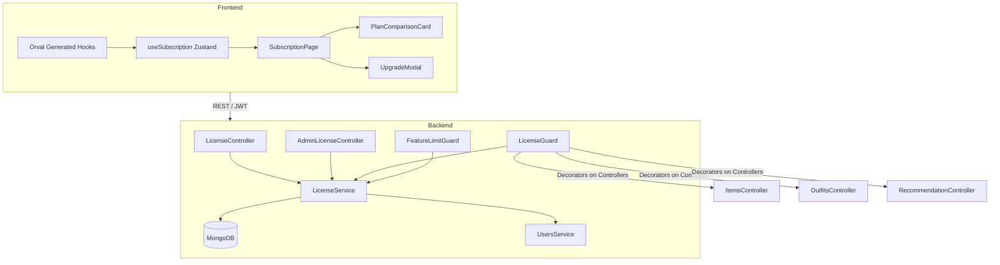
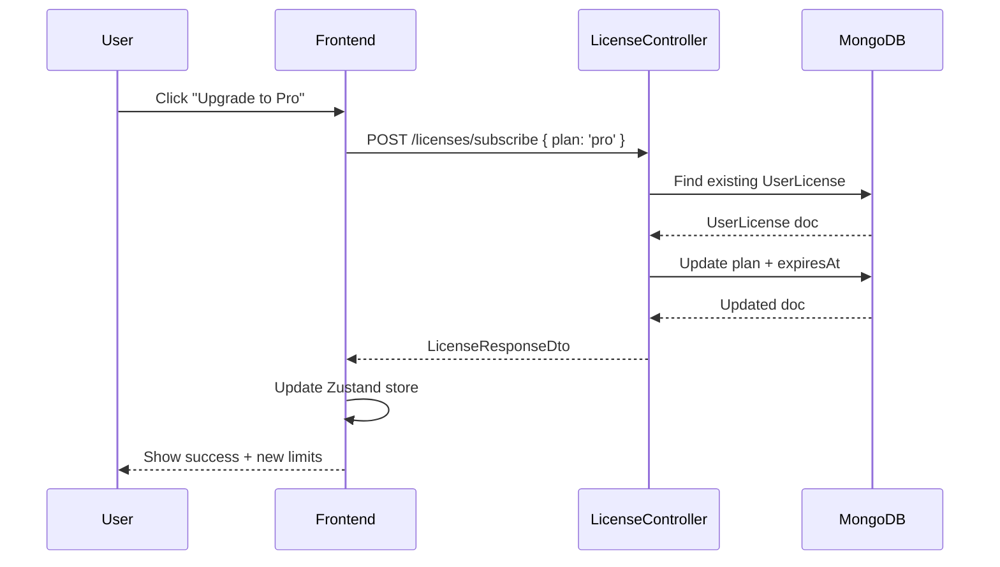
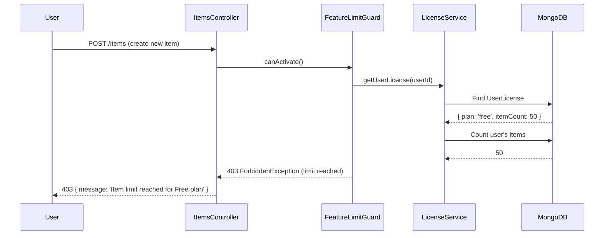

# Design Document: License Management

## Overview

The License Management system introduces tiered subscription plans (Free, Pro, Premium) to the wardrobe app. It enforces per-plan feature limits (max items, max outfits, AI features) via a NestJS guard, exposes admin APIs for plan management, and provides a frontend subscription page with plan comparison and upgrade flow.

---

## Architecture



---

## Sequence Diagrams

### Subscription Upgrade Flow



### Feature Limit Enforcement Flow



---

## Components and Interfaces

### Backend Modules

#### LicenseModule
- `LicensePlan` schema — stores plan definitions and their limits
- `UserLicense` schema — stores per-user active subscription
- `LicenseService` — core business logic
- `LicenseController` — user-facing endpoints (`/licenses`)
- `AdminLicenseController` — admin endpoints (`/admin/licenses`)
- `FeatureLimitGuard` — enforces item/outfit/AI limits
- `RequireFeature` decorator — marks which feature a route consumes

#### Integration Points
- `UsersModule` — read user data, attach license info to `GET /auth/me`
- `ItemsModule` — guard on `POST /items`
- `OutfitsModule` — guard on `POST /outfits`
- `RecommendationModule` — guard on `GET /recommendation/ootd`

---

## Data Models

### LicensePlan Schema

```typescript
interface LicensePlan {
  _id: ObjectId
  name: 'free' | 'pro' | 'premium'
  displayName: string          // "Free", "Pro", "Premium"
  price: number                // monthly price in USD
  limits: {
    maxItems: number           // -1 = unlimited
    maxOutfits: number         // -1 = unlimited
    aiFeatures: boolean        // OOTD recommendation access
    importExport: boolean      // CSV import/export
    analytics: boolean         // dashboard analytics
  }
  isActive: boolean
  createdAt: Date
  updatedAt: Date
}
```

### UserLicense Schema

```typescript
interface UserLicense {
  _id: ObjectId
  userId: ObjectId             // ref: User
  plan: 'free' | 'pro' | 'premium'
  status: 'active' | 'expired' | 'cancelled'
  startedAt: Date
  expiresAt: Date | null       // null = lifetime / manual
  createdAt: Date
  updatedAt: Date
}
```

### Plan Limits Reference

| Feature         | Free | Pro  | Premium |
|-----------------|------|------|---------|
| Max Items       | 50   | 200  | -1      |
| Max Outfits     | 10   | 50   | -1      |
| AI Features     | ✗    | ✓    | ✓       |
| Import/Export   | ✗    | ✓    | ✓       |
| Analytics       | ✗    | ✗    | ✓       |
| Price/month     | $0   | $9   | $19     |

---

## Error Handling

### Limit Exceeded
- Condition: User attempts to create an item/outfit beyond their plan limit
- Response: `403 ForbiddenException` with `{ message: 'Item limit reached. Upgrade your plan.' }`
- Recovery: Frontend shows upgrade prompt modal

### Feature Not Available
- Condition: Free user accesses AI recommendation or import/export
- Response: `403 ForbiddenException` with `{ message: 'This feature requires a Pro or Premium plan.' }`
- Recovery: Frontend redirects to `/subscription`

### No License Found
- Condition: User has no `UserLicense` document (new user)
- Response: Service auto-creates a Free license on first access
- Recovery: Transparent to user

### Expired License
- Condition: `expiresAt` is in the past
- Response: Guard downgrades effective plan to `free` for limit checks
- Recovery: User prompted to renew

---

## Testing Strategy

### Unit Testing
- `LicenseService`: test `getUserLicense`, `subscribe`, `checkLimit` with mocked Mongoose models
- `FeatureLimitGuard`: test `canActivate` with mocked `LicenseService` returning various plan states

### Property-Based Testing
- Library: `fast-check`
- Property: For any `itemCount` ≥ `plan.limits.maxItems` (where maxItems ≠ -1), `checkLimit('items')` must return `false`
- Property: For any `plan` with `aiFeatures: false`, `checkFeature('aiFeatures')` must return `false`

### Integration Testing
- `POST /items` with Free user at 50 items → expect 403
- `GET /recommendation/ootd` with Free user → expect 403
- `POST /licenses/subscribe { plan: 'pro' }` → expect 200 + updated license

---

## Security Considerations

- All `/licenses` endpoints require `JwtAuthGuard`
- All `/admin/licenses` endpoints require `JwtAuthGuard` + `RolesGuard` with `admin` role
- `FeatureLimitGuard` always runs after `JwtAuthGuard` — never before
- Plan downgrades on expiry are enforced server-side; client cannot self-report plan

---

## Dependencies

- No new npm packages required
- Uses existing: `@nestjs/mongoose`, `class-validator`, `@nestjs/swagger`, `@nestjs/passport`
- Frontend uses Orval-generated hooks — no manual fetch calls
