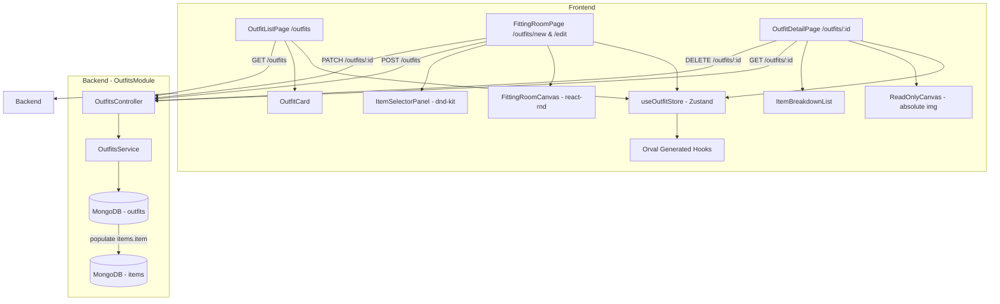
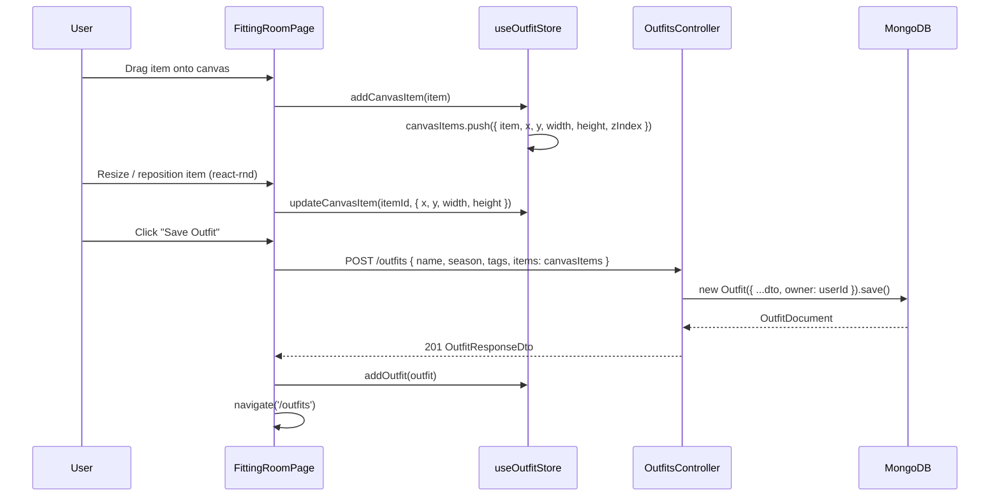
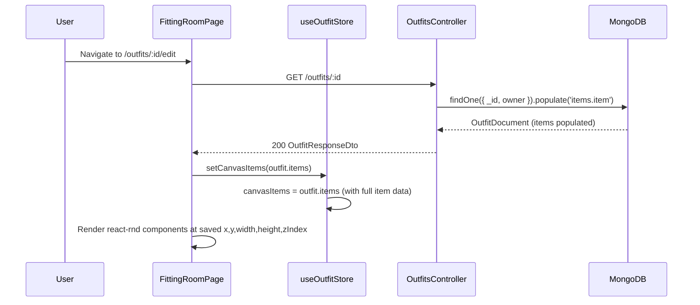
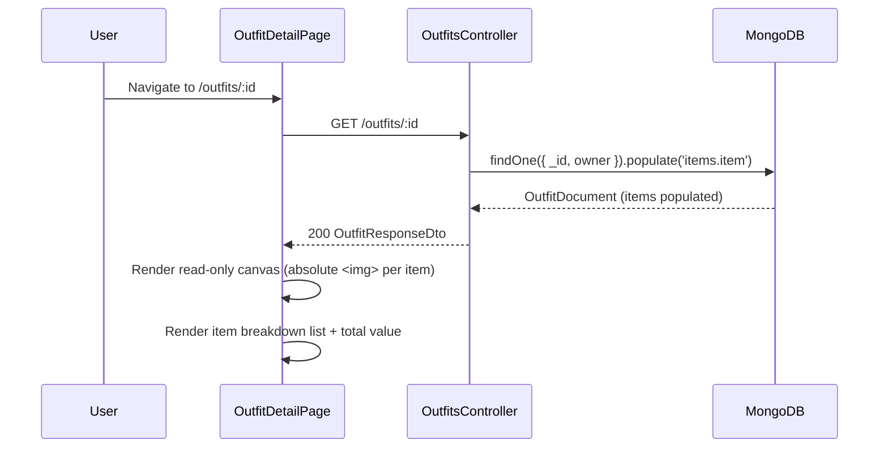
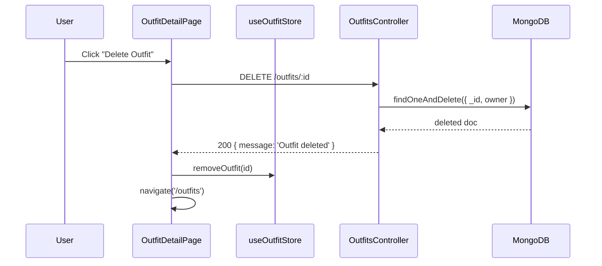

# Design Document: Outfit Builder

## Overview

The Outfit Builder lets authenticated users compose outfits by dragging wardrobe items onto a canvas layered over a model image, then saving the exact spatial layout (x, y, width, height, zIndex) per item. The feature spans three views: an Outfit List page (`/outfits`), a Fitting Room builder (`/outfits/new`, `/outfits/:id/edit`), and a read-only Outfit Detail page (`/outfits/:id`).

The backend module (`OutfitsModule`) is already fully scaffolded with schema, service, and controller — but every endpoint is missing `@ApiOperation`, `@ApiResponse`, and an `OutfitResponseDto`. These gaps must be closed first so Orval can generate typed frontend hooks. No new schema or service logic is required.

---

## Architecture



---

## Sequence Diagrams

### Create Outfit (Fitting Room → Save)



### Load Outfit for Edit



### View Outfit Detail



### Delete Outfit



---

## Components and Interfaces

### Backend

#### OutfitsController — `/outfits`

| Method | Endpoint | Guard | Description |
|--------|----------|-------|-------------|
| POST | `/outfits` | JwtAuthGuard | Create new outfit; owner set from JWT |
| GET | `/outfits` | JwtAuthGuard | List all outfits for current user (items populated) |
| GET | `/outfits/:id` | JwtAuthGuard | Get single outfit by ID (items populated) |
| PATCH | `/outfits/:id` | JwtAuthGuard | Update outfit; owner-scoped |
| DELETE | `/outfits/:id` | JwtAuthGuard | Delete outfit; owner-scoped |

#### OutfitsService

```typescript
interface OutfitsService {
  create(dto: CreateOutfitDto, userId: string): Promise<Outfit>
  findAll(userId: string): Promise<Outfit[]>                      // populated items.item
  findOne(id: string, userId: string): Promise<Outfit>            // populated items.item; 404 if not found
  update(id: string, dto: UpdateOutfitDto, userId: string): Promise<Outfit>  // 404 if not found
  remove(id: string, userId: string): Promise<Outfit>             // 404 if not found
}
```

All methods are already implemented. No service changes required.

### Frontend

#### Pages

| Component | Route | Description |
|-----------|-------|-------------|
| `OutfitListPage` | `/outfits` | Grid of `OutfitCard` components |
| `FittingRoomPage` | `/outfits/new` | Create new outfit in builder |
| `FittingRoomPage` | `/outfits/:id/edit` | Edit existing outfit in builder |
| `OutfitDetailPage` | `/outfits/:id` | Read-only canvas + item breakdown |

#### Components

| Component | Props | Description |
|-----------|-------|-------------|
| `OutfitCard` | `{ outfit: OutfitResponseDto }` | Collage thumbnail + season badge + item count |
| `CollageGrid` | `{ items: PopulatedOutfitItem[] }` | Dynamic 1/2/3/4+ image grid |
| `FittingRoomCanvas` | `{ canvasItems, onUpdate, onRemove }` | react-rnd draggable/resizable canvas |
| `ItemSelectorPanel` | `{ onAddItem }` | Category filter + item grid; dnd-kit draggable source |
| `ReadOnlyCanvas` | `{ items: PopulatedOutfitItem[] }` | Absolute-positioned `` reconstruction |
| `ItemBreakdownList` | `{ items: PopulatedOutfitItem[] }` | Thumbnail + name + category + brand per item |
| `OutfitMetaForm` | `{ value, onChange }` | Name, season, tags inputs for builder |

#### Zustand Store: `useOutfitStore`

```typescript
interface OutfitState {
  outfits: OutfitResponseDto[]
  selectedOutfit: OutfitResponseDto | null
  canvasItems: CanvasItem[]                        // builder working state
  isLoading: boolean

  setOutfits: (outfits: OutfitResponseDto[]) => void
  addOutfit: (outfit: OutfitResponseDto) => void
  updateOutfit: (outfit: OutfitResponseDto) => void
  removeOutfit: (id: string) => void
  setSelectedOutfit: (outfit: OutfitResponseDto | null) => void

  // Canvas builder actions
  addCanvasItem: (item: CanvasItem) => void
  updateCanvasItem: (itemId: string, patch: Partial<CanvasItemPosition>) => void
  removeCanvasItem: (itemId: string) => void
  setCanvasItems: (items: CanvasItem[]) => void
  clearCanvas: () => void
}

interface CanvasItemPosition {
  x: number
  y: number
  width: number
  height: number
  zIndex: number
}

interface CanvasItem extends CanvasItemPosition {
  item: PopulatedItemDto   // full item object (from populated response)
}
```

---

## Data Models

### Outfit Schema (existing — `outfit.schema.ts`)

```typescript
// No changes required — schema is complete
interface OutfitItem {
  item: ObjectId | Item   // ref: Item — populated on GET
  x: number
  y: number
  width: number
  height: number
  zIndex: number
}

interface Outfit {
  _id: ObjectId
  name: string            // required
  description?: string
  items: OutfitItem[]
  tags: string[]
  season: 'Spring' | 'Summer' | 'Autumn' | 'Winter' | 'All'
  owner: ObjectId         // ref: User — required
  createdAt: Date
  updatedAt: Date
}
```

### DTOs

**OutfitItemDto** (existing — `create-outfit.dto.ts`)
```typescript
class OutfitItemDto {
  @ApiProperty() @IsMongoId()  item: string
  @ApiProperty() @IsNumber()   x: number
  @ApiProperty() @IsNumber()   y: number
  @ApiProperty() @IsNumber()   width: number
  @ApiProperty() @IsNumber()   height: number
  @ApiProperty() @IsNumber()   zIndex: number
}
```

**CreateOutfitDto** (existing — `create-outfit.dto.ts`)
```typescript
class CreateOutfitDto {
  @ApiProperty()                          name: string
  @ApiPropertyOptional()                  description?: string
  @ApiProperty({ type: [OutfitItemDto] }) items: OutfitItemDto[]
  @ApiPropertyOptional({ type: [String]}) tags?: string[]
  @ApiPropertyOptional({ enum: Season })  season?: Season
}
```

**OutfitResponseDto** (missing — must be created)
```typescript
class OutfitItemResponseDto {
  @ApiProperty() item: ItemResponseDto   // populated item object
  @ApiProperty() x: number
  @ApiProperty() y: number
  @ApiProperty() width: number
  @ApiProperty() height: number
  @ApiProperty() zIndex: number
}

class OutfitResponseDto {
  @ApiProperty()                                    _id: string
  @ApiProperty()                                    name: string
  @ApiPropertyOptional()                            description?: string
  @ApiProperty({ type: [OutfitItemResponseDto] })   items: OutfitItemResponseDto[]
  @ApiProperty({ type: [String] })                  tags: string[]
  @ApiProperty({ enum: Season })                    season: Season
  @ApiProperty()                                    createdAt: Date
  @ApiProperty()                                    updatedAt: Date
}
```

---

## Key Functions with Formal Specifications

### `OutfitsService.findOne(id, userId)`

**Preconditions:**
- `id` is a valid MongoDB ObjectId string
- `userId` is the authenticated user's `_id` from JWT

**Postconditions:**
- Returns `Outfit` with `items.item` fully populated
- Throws `NotFoundException` if no document matches `{ _id: id, owner: userId }`
- Never returns an outfit belonging to a different user

### `FittingRoomCanvas` — `onDragStop` / `onResizeStop`

**Preconditions:**
- `itemId` exists in `canvasItems`
- `x`, `y`, `width`, `height` are finite numbers ≥ 0

**Postconditions:**
- `useOutfitStore.updateCanvasItem(itemId, { x, y, width, height })` is called
- Canvas re-renders with updated position/size
- No other canvas items are mutated

### `buildSavePayload(canvasItems, meta)`

**Preconditions:**
- `canvasItems` is non-empty array
- `meta.name` is non-empty string

**Postconditions:**
- Returns `CreateOutfitDto`-shaped object
- Each `items[n].item` is the item's `_id` string (not the full object)
- All spatial values (`x`, `y`, `width`, `height`, `zIndex`) are numbers

---

## Error Handling

### Outfit Not Found
- Condition: `GET /outfits/:id` or `PATCH /outfits/:id` or `DELETE /outfits/:id` — no doc matching `{ _id, owner }`
- Response: `404 NotFoundException` — `{ message: 'Outfit with ID <id> not found' }`
- Frontend: Show toast error; navigate back to `/outfits`

### Unauthorized Access
- Condition: Any endpoint called without valid JWT
- Response: `401 Unauthorized`
- Frontend: Redirect to `/login`

### Empty Canvas Save Attempt
- Condition: User clicks "Save" with no items on canvas
- Response: Client-side validation only — no API call made
- Frontend: Show inline error "Add at least one item to save an outfit"

### Item Drag Outside Canvas Bounds
- Condition: react-rnd `onDragStop` fires with position outside canvas container
- Response: Clamp `x`/`y` to canvas bounds before calling `updateCanvasItem`
- Frontend: Item snaps to nearest valid position

---

## Testing Strategy

### Unit Testing
- `OutfitsService.findOne`: mock `outfitModel.findOne` returning null → expect `NotFoundException`
- `OutfitsService.update`: mock `findOneAndUpdate` returning null → expect `NotFoundException`
- `OutfitsService.remove`: mock `findOneAndDelete` returning null → expect `NotFoundException`
- `buildSavePayload`: given `canvasItems` with full item objects → output `items[n].item` is string `_id`

### Property-Based Testing
- Library: `fast-check`
- Property: For any `userId`, `findAll(userId)` always returns array where every element's `owner` equals `userId`
- Property: For any valid `canvasItems` array, `buildSavePayload` always produces `items` array of same length with numeric spatial values

### Integration Testing
- `POST /outfits` → `GET /outfits/:id` → items are populated objects, not ObjectIds
- `PATCH /outfits/:id` with new items array → `GET /outfits/:id` reflects updated items
- `DELETE /outfits/:id` → subsequent `GET /outfits/:id` returns 404
- All endpoints without Bearer token → 401
- `GET /outfits/:id` with another user's outfit ID → 404

---

## Performance Considerations

- `GET /outfits` populates `items.item` — for large wardrobes, limit populated fields to `name`, `imageAssets`, `category`, `brand`, `price` using `.populate('items.item', 'name imageAssets category brand price')`
- `CollageGrid` renders at most 4 images regardless of outfit size — no virtualization needed
- `ReadOnlyCanvas` uses standard `` tags (not react-rnd) to avoid unnecessary drag/resize overhead on the detail view
- Canvas images are already background-removed PNGs via Cloudinary — no additional processing on render

---

## Security Considerations

- All endpoints require `JwtAuthGuard` — unauthenticated requests return 401
- `OutfitsService` always scopes queries by `owner: userId` from JWT — users cannot read or mutate other users' outfits
- `OutfitResponseDto` does not expose the `owner` field — prevents user ID leakage
- Item images are served from Cloudinary CDN URLs stored in the database — no direct file access

---

## Dependencies

All dependencies already installed:

| Package | Usage |
|---------|-------|
| `react-rnd` | Draggable + resizable canvas items in FittingRoomPage |
| `@dnd-kit/core` | MouseSensor + TouchSensor for item selector drag source |
| `zustand` | `useOutfitStore` global state |
| Orval (generated) | All API hooks — no manual fetch/axios |
| `tailwindcss` | All styling |
| `@nestjs/mongoose` + `mongoose` | Outfit schema + queries |
| `class-validator` + `class-transformer` | DTO validation |
| `@nestjs/swagger` | Swagger decorators → Orval source |
