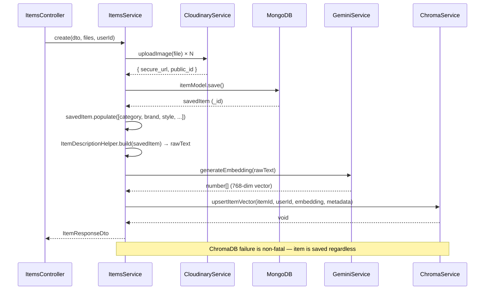
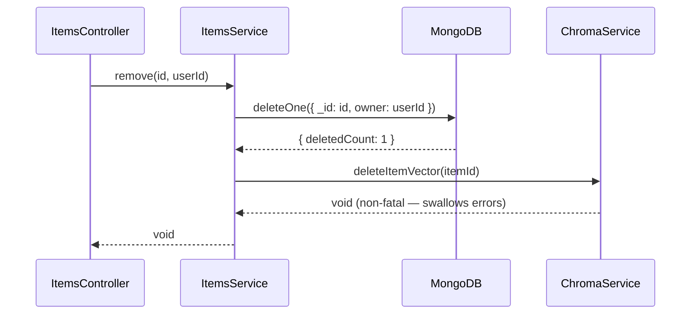

# Design Document: AI Outfit Recommendation (OOTD)

## Overview

The Recommendation module implements a Retrieval-Augmented Generation (RAG) pipeline that acts as an AI fashion stylist. When the Home Dashboard is loaded, the system embeds the current weather context into a query vector, retrieves the top 15 most contextually relevant wardrobe items from ChromaDB via cosine similarity, then passes those candidates to Gemini to compose a complete Outfit Of The Day (OOTD). If any step in the pipeline fails, the system falls back to rule-based random selection from MongoDB to guarantee high availability.

The backend service (`RecommendationService.getOotd`) and the ChromaDB/Gemini infrastructure are already implemented. This spec focuses on three gaps: (1) the embedding ingestion pipeline in `ItemsService` (already wired but needs Swagger-complete DTOs and `deleteItemVector` on item removal), (2) ChromaDB collection management (single shared collection with `userId` metadata filter — already implemented), and (3) the `RecommendationModule` architecture (no controller — OOTD is consumed exclusively via `DashboardService`).

---

## Architecture

```mermaid
graph TD
    subgraph Ingestion Pipeline - ItemsService
        A[POST /items - create] --> B[Cloudinary Upload]
        B --> C[Save to MongoDB]
        C --> D[ItemDescriptionHelper.build]
        D --> E[GeminiService.generateEmbedding]
        E --> F[ChromaService.upsertItemVector]
        F --> G[(ChromaDB - wardrobe_items collection)]

        H[PATCH /items/:id - update] --> I[Update MongoDB]
        I --> D

        J[DELETE /items/:id - remove] --> K[Delete from MongoDB]
        K --> L[ChromaService.deleteItemVector]
        L --> G
    end

    subgraph RAG Pipeline - RecommendationService
        M[DashboardService.getHomeDashboard] --> N[RecommendationService.getOotd]
        N --> O[Build weatherContext string]
        O --> P[GeminiService.generateEmbedding]
        P --> Q[ChromaService.querySimilarItems - Top 15]
        Q --> R[(ChromaDB - userId filter)]
        R --> S[Fetch candidates from MongoDB]
        S --> T[GeminiService.generateOutfitFromCandidates]
        T --> U[Hydrate items from MongoDB]
        U --> V[OotdResponseDto - source: ai]

        N -->|any error| W[getFallbackOotd]
        W --> X[Random top + bottom from MongoDB]
        X --> Y[OotdResponseDto - source: fallback]
    end

    subgraph Module Boundaries
        Z[RecommendationModule] -->|exports RecommendationService| AA[DashboardModule]
        BB[ItemsModule] -->|uses GeminiService + ChromaService| CC[ChromaModule]
    end
```



---

## Sequence Diagrams

### Item Creation — Embedding Ingestion



### OOTD RAG Pipeline

```mermaid
sequenceDiagram
    participant DS as DashboardService
    participant RS as RecommendationService
    participant G as GeminiService
    participant Ch as ChromaService
    participant DB as MongoDB

    DS->>RS: getOotd(userId, weather)
    RS->>RS: Build weatherContext string
    RS->>G: generateEmbedding(weatherContext)
    G-->>RS: queryVector number[]
    RS->>Ch: querySimilarItems(userId, queryVector, 15)
    Ch-->>RS: topItemIds string[]

    alt topItemIds empty
        RS-->>DS: getFallbackOotd()
    else candidates found
        RS->>DB: find({ _id: $in topItemIds }).select('_id name color category tags')
        DB-->>RS: candidates[]
        RS->>G: generateOutfitFromCandidates(weatherContext, candidates)
        Note over G: 5s timeout race; returns { selectedIds, reason }
        G-->>RS: finalOutfitIds string[]
        RS->>DB: find({ _id: $in finalOutfitIds }).populate('category')
        DB-->>RS: hydratedItems[]
        RS-->>DS: OotdResponseDto { items, source: 'ai', reason }
    end

    alt any error thrown
        RS-->>DS: getFallbackOotd() → { items: [], source: 'fallback' }
    end
```

### Item Deletion — Vector Cleanup



---

## Components and Interfaces

### Backend

#### RecommendationModule — `back-end/src/recommendation/`

**No controller** — `RecommendationService` is consumed internally by `DashboardService` only. OOTD is exposed via `GET /dashboard/home`.

```
back-end/src/recommendation/
├── dto/
│   └── ootd-response.dto.ts    ✓ complete — OotdResponseDto, OotdItemDto, WardrobeItemContextDto
├── recommendation.module.ts    ✓ complete — exports RecommendationService
└── recommendation.service.ts   ✓ complete — getOotd(userId, weather), getFallbackOotd()
```

No changes needed to the recommendation module itself.

#### ChromaModule — `back-end/src/chroma/`

```
back-end/src/chroma/
├── chroma.module.ts     ✓ complete
├── chroma.service.ts    ✓ complete — upsertItemVector, deleteItemVector, querySimilarItems
└── gemini.service.ts    ✓ complete — generateEmbedding, generateOutfitFromCandidates, autoDetectAttributes
```

No changes needed.

#### ItemsModule — `back-end/src/items/`

**Gap**: `ItemsService.remove()` deletes from MongoDB but does **not** call `ChromaService.deleteItemVector()`. This leaves orphaned vectors in ChromaDB that pollute future similarity searches.

**Fix**: After `deleteOne()` succeeds, call `this.chromaService.deleteItemVector(id)` in a non-fatal try/catch.

```typescript
// items.service.ts — updated remove()
async remove(id: string, userId: string): Promise<void> {
  const result = await this.itemModel.deleteOne({ _id: id, owner: userId }).exec()
  if (result.deletedCount === 0) throw new NotFoundException('Item not found')

  // Sync deletion to ChromaDB (non-fatal)
  try {
    await this.chromaService.deleteItemVector(id)
  } catch (error) {
    this.logger.error(`Failed to delete vector for item ${id}`, error)
  }
}
```

---

### ChromaDB Collection Design

| Property | Value |
|----------|-------|
| Collection name | `wardrobe_items` (single shared collection) |
| Distance metric | Cosine similarity (`hnsw:space: 'cosine'`) |
| Document ID | MongoDB `_id.toString()` |
| Metadata fields | `userId` (string), `categoryId`, `color`, `seasonId`, `occasionId` |
| User isolation | `where: { userId: { $eq: cleanUserId } }` filter on every query |
| Embedding model | `gemini-embedding-001` (768-dim) |

---

### Embedding Text Format

`ItemDescriptionHelper.build(item)` produces the text that is embedded:

```
Item: {name}. Category: {category.name}. Brand: {brand.name}. Style: {style.name}. Occasion: {occasion.name}. Season: {seasonCode.name}. Neckline: {neckline.name}. Sleeve Length: {sleeveLength.name}. Color: {color}. Tags: {tag1, tag2, ...}.
```

All populated refs are resolved before calling `generateEmbedding`. Null refs produce the string `"null"` — acceptable for embedding purposes.

---

## Data Models

### `OotdResponseDto` (existing — Swagger-complete)

```typescript
class OotdItemDto {
  _id: string           // MongoDB ObjectId
  name: string
  category: string      // populated category name
  color: string
  images: string[]      // Cloudinary URLs
}

class OotdResponseDto {
  items: OotdItemDto[]
  source: 'ai' | 'fallback'
  reason?: string       // Gemini's explanation or fallback message
}
```

### `WardrobeItemContextDto` (internal — not exposed via API)

```typescript
// Sent to Gemini — text-only, no image URLs to save tokens
class WardrobeItemContextDto {
  id: string
  name: string
  category: string
  color: string
  tags: string[]
}
```

### `Item.embedding` field (existing)

```typescript
@Prop({ type: [Number], select: false })
embedding: number[]
// select: false — never returned in API responses
// Populated only during ingestion; not used in retrieval (ChromaDB owns the vectors)
```

> Note: The `embedding` field on the Mongoose schema is a legacy/backup field. The authoritative vector store is ChromaDB. The field is kept for potential future use (e.g., MongoDB Atlas Vector Search migration).

---

## Key Functions with Formal Specifications

### `ItemsService.create()` — Embedding Ingestion

**Preconditions:**
- `files` may be empty (item without images is valid)
- `createItemDto.location` is a valid MongoDB ObjectId
- `userId` is a valid authenticated user `_id`

**Postconditions:**
- Item is persisted in MongoDB with `status: 'completed'`
- If `GeminiService.generateEmbedding` succeeds: vector is upserted to ChromaDB with `userId` metadata
- If `GeminiService.generateEmbedding` fails: item is still saved; error is logged; no exception propagated to caller
- Returns `ItemResponseDto` regardless of ChromaDB sync outcome

**Loop Invariants (image upload loop):**
- Each iteration uploads exactly one file to Cloudinary
- `images[]` and `imageAssets[]` grow monotonically; no duplicates within a single create call

---

### `ItemsService.remove()` — Vector Cleanup

**Preconditions:**
- `id` is a valid MongoDB ObjectId string
- `userId` matches the item's `owner` field

**Postconditions:**
- Item is deleted from MongoDB (`deletedCount === 1`)
- Vector is deleted from ChromaDB (best-effort; failure is non-fatal)
- If `deletedCount === 0`: throws `NotFoundException`; ChromaDB deletion is not attempted

---

### `RecommendationService.getOotd()` — RAG Pipeline

**Preconditions:**
- `userId` is a valid authenticated user `_id`
- `weather` is a valid `WeatherResponseDto` with non-null `temperature`, `description`, `humidity`, `condition`

**Postconditions:**
- Always returns a valid `OotdResponseDto` (never throws to caller)
- If RAG pipeline succeeds: `source === 'ai'`, `items.length >= 1`, `reason` is populated
- If RAG pipeline fails at any step: `source === 'fallback'`, `items` may be empty
- Gemini generation step has a hard 5-second timeout enforced via `Promise.race`

**Loop Invariants:** N/A (no loops — pipeline is sequential async steps)

---

### `ChromaService.querySimilarItems()` — Vector Retrieval

**Preconditions:**
- `userId` is a non-empty string (coerced to primitive via `.toString()`)
- `queryEmbedding` is a non-empty `number[]` matching the collection's embedding dimension
- `limit` is a positive integer (default: 15)

**Postconditions:**
- Returns `string[]` of MongoDB `_id` values (may be empty if no items match)
- Results are filtered exclusively to `userId` — no cross-user data leakage
- On ChromaDB error: returns `[]` (non-fatal)

---

## Algorithmic Pseudocode

### RAG Pipeline — `getOotd`

```pascal
PROCEDURE getOotd(userId, weather)
  INPUT: userId: string, weather: WeatherResponseDto
  OUTPUT: OotdResponseDto

  BEGIN
    TRY
      // Step 1: Build context
      weatherContext ← formatWeatherString(weather)

      // Step 2: Embed context
      queryVector ← GeminiService.generateEmbedding(weatherContext)

      // Step 3: Retrieve top 15 from ChromaDB
      topItemIds ← ChromaService.querySimilarItems(userId, queryVector, 15)

      IF topItemIds IS EMPTY THEN
        RETURN getFallbackOotd()
      END IF

      // Step 4: Fetch candidate metadata (text-only, no images)
      candidates ← MongoDB.find({ _id: IN topItemIds })
                          .select('_id name color category tags')

      // Step 5: Gemini selects final outfit (5s timeout)
      finalOutfitIds ← RACE(
        GeminiService.generateOutfitFromCandidates(weatherContext, candidates),
        TIMEOUT(5000ms)
      )

      // Step 6: Hydrate with full data for frontend
      hydratedItems ← MongoDB.find({ _id: IN finalOutfitIds })
                              .populate('category')

      RETURN { items: hydratedItems, source: 'ai', reason: geminiReason }

    CATCH error
      LOG error
      RETURN getFallbackOotd()
    END TRY
  END
END PROCEDURE
```

### Embedding Ingestion — `syncToChroma`

```pascal
PROCEDURE syncToChroma(savedItem, userId)
  INPUT: savedItem: Item (populated), userId: string
  OUTPUT: void (non-fatal)

  BEGIN
    TRY
      rawText ← ItemDescriptionHelper.build(savedItem)
      embedding ← GeminiService.generateEmbedding(rawText)
      ChromaService.upsertItemVector(
        savedItem._id.toString(),
        userId,
        embedding,
        {
          categoryId: savedItem.category?._id?.toString() OR '',
          color: savedItem.color OR '',
          seasonId: savedItem.seasonCode?._id?.toString() OR '',
          occasionId: savedItem.occasion?._id?.toString() OR ''
        }
      )
    CATCH error
      LOG "Failed to sync item to vector DB: " + error
      // Do NOT re-throw — item save must succeed regardless
    END TRY
  END
END PROCEDURE
```

---

## Error Handling

### ChromaDB Unavailable at Startup
- Condition: `ChromaService.onModuleInit()` fails to connect
- Response: NestJS throws on startup — application does not start
- Recovery: Ensure ChromaDB container is running (`docker-compose up chroma`)

### Gemini API Key Missing
- Condition: `GEMINI_API_KEY` not set in `.env`
- Response: `GeminiService` logs error; `this.gemini` is `null`; all Gemini methods return `[]` or throw
- Recovery: `RecommendationService` catches and falls back to `getFallbackOotd()`

### Gemini Timeout (> 5s)
- Condition: `generateOutfitFromCandidates` exceeds 5000ms
- Response: `Promise.race` rejects with timeout error; caught by outer `try/catch`
- Recovery: `getFallbackOotd()` returns rule-based result

### ChromaDB Vector Not Found (empty wardrobe)
- Condition: User has no items or no vectors in ChromaDB
- Response: `querySimilarItems` returns `[]`; `getOotd` detects empty and calls `getFallbackOotd()`
- Recovery: Fallback returns `{ items: [], source: 'fallback', reason: 'Rule-based logic' }`

### Orphaned Vectors (item deleted without vector cleanup)
- Condition: `remove()` was called before the `deleteItemVector` fix
- Response: ChromaDB may return IDs for deleted MongoDB documents; `find({ _id: $in })` silently returns fewer results
- Recovery: The hydration step naturally handles missing items — no crash

---

## Testing Strategy

### Unit Testing

- `ItemsService.remove()`: after fix, verify `chromaService.deleteItemVector` is called with correct `id`; verify it is NOT called when `deletedCount === 0`
- `RecommendationService.getOotd()`: mock `GeminiService` timeout → verify `getFallbackOotd()` is returned; mock empty `querySimilarItems` → verify fallback
- `ChromaService.querySimilarItems()`: verify `where: { userId: { $eq: cleanUserId } }` filter is always applied
- `ItemDescriptionHelper.build()`: verify output string format for items with null refs

### Property-Based Testing

Library: `fast-check`

- Property: For any valid `WeatherResponseDto`, `getOotd` always returns an `OotdResponseDto` with `source` in `['ai', 'fallback']` — never throws
- Property: For any `Item` with any combination of null/non-null metadata refs, `ItemDescriptionHelper.build()` returns a non-empty string

### Integration Testing

- `POST /items` → verify ChromaDB collection contains a document with matching `itemId` and `userId` metadata
- `DELETE /items/:id` → verify ChromaDB document is removed after deletion
- `PATCH /items/:id` → verify ChromaDB vector is updated (upsert) with new embedding
- `GET /dashboard/home` with a wardrobe of 5+ items → `ootd.source === 'ai'` and `ootd.items.length >= 1`
- `GET /dashboard/home` with empty wardrobe → `ootd.source === 'fallback'`

---

## Performance Considerations

- Embedding generation (`generateEmbedding`) is called synchronously during item create/update — adds ~200-500ms latency to those endpoints. This is acceptable for a wardrobe app where item creation is infrequent.
- The RAG pipeline runs in parallel with `fetchRecentItems` and `fetchWardrobeStats` inside `DashboardService.Promise.all` — total dashboard latency is bounded by the slowest of the three, not their sum.
- ChromaDB uses HNSW index with cosine similarity — `querySimilarItems` is O(log n) and sub-100ms for typical wardrobe sizes (< 1000 items).
- Gemini `generateOutfitFromCandidates` uses `gemini-3.1-flash-lite-preview` with `temperature: 0.2` — optimised for speed and determinism over creativity.

---

## Security Considerations

- All ChromaDB queries include `where: { userId: { $eq: cleanUserId } }` — strict user isolation; no cross-user vector leakage
- `userId` is coerced to a primitive string before the ChromaDB filter to prevent Mongoose `ObjectId` buffer injection
- `Item.embedding` field has `select: false` — never returned in any API response
- `WardrobeItemContextDto` sent to Gemini contains only `id`, `name`, `color`, `category`, `tags` — no PII, no image URLs
- Gemini prompt explicitly instructs the model to only use IDs from the provided list — prevents hallucinated ObjectIds

---

## Dependencies

All dependencies already installed:

| Package | Purpose |
|---------|---------|
| `chromadb` | Vector database client |
| `@google/generative-ai` | Gemini embedding + generation |
| `@nestjs/mongoose` + `mongoose` | MongoDB ODM |
| `@nestjs/swagger` + `class-validator` | DTO validation + Swagger |
