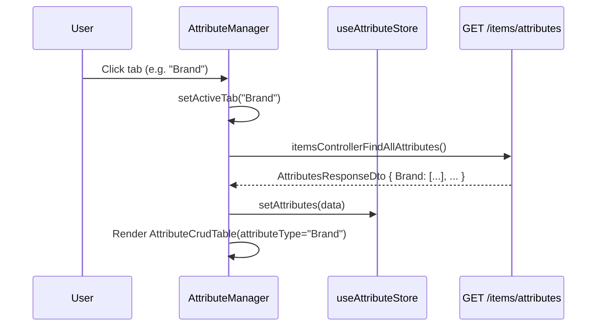
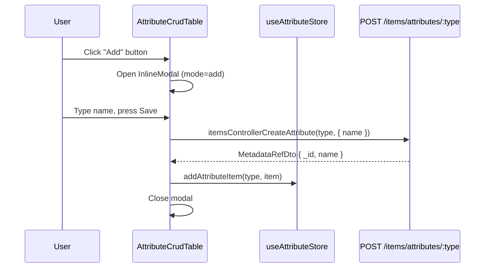
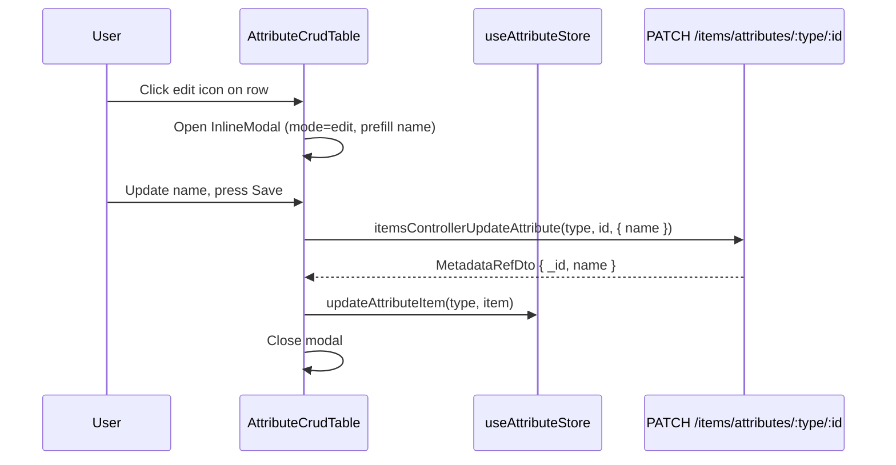
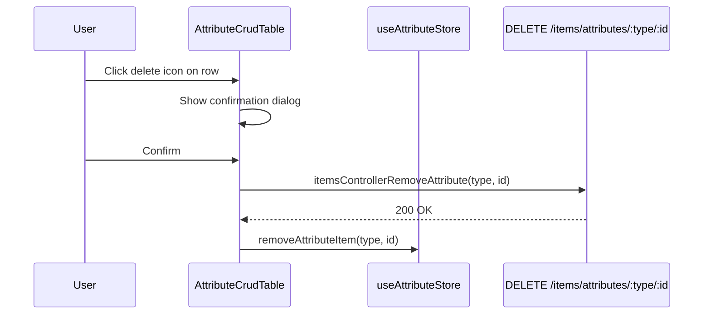

# Design Document: Settings — Attributes Management

## Overview

The Settings > Attributes sub-page (`/settings/attributes`) lets users manage the dictionary values used to classify wardrobe items (Brand, Category, Style, Size, etc.). The backend CRUD is already fully implemented under `/items/attributes/:type`; this feature is purely a frontend concern with a minor Swagger hardening pass to ensure Orval generates correctly-typed hooks.

The UI is a tabbed interface where each tab maps to one attribute type. Switching tabs fetches that type's data. All CRUD actions (add, edit, delete) are handled inside a shared `AttributeCrudTable` component that receives `attributeType` as a prop, keeping the implementation DRY and dynamically driven.

---

## Architecture

```mermaid
graph TD
    A[SettingsPage /settings] --> B[AttributeManager /settings/attributes]
    B --> C[Tabs: Category | Brand | Size | Style | SeasonCode | Neckline | Occasion | SleeveLength | Shoulder]
    C --> D[AttributeCrudTable attributeType=activeTab]
    D --> E[useAttributeStore Zustand]
    D --> F[Orval Hooks]
    F --> G[GET /items/attributes]
    F --> H[POST /items/attributes/:type]
    F --> I[PATCH /items/attributes/:type/:id]
    F --> J[DELETE /items/attributes/:type/:id]
    E --> K[attributes: Record<string, MetaItem[]>]
```

---

## Sequence Diagrams

### Tab Switch — Load Attribute List



### Add Attribute



### Edit Attribute



### Delete Attribute



---

## Components and Interfaces

### `AttributeManager` (page-level)

**Purpose**: Shell component rendered at `/settings/attributes`. Owns the tab state and triggers the initial data fetch. Reads from `useAttributeStore`.

**Interface**:
```typescript
// No external props — rendered directly by router
export const AttributeManager: React.FC
```

**Responsibilities**:
- Maintain `activeTab: string` local state (default: `'Category'`)
- On mount → call `itemsControllerFindAllAttributes()` → dispatch to `useAttributeStore.setAttributes()`
- Render horizontal scrollable tab bar from `ATTRIBUTE_TYPES` constant
- Render `<AttributeCrudTable key={activeTab} attributeType={activeTab} />`
- Show loading spinner while initial fetch is in progress

---

### `AttributeCrudTable`

**Purpose**: Reusable table component that handles CRUD for a single attribute type. Reads its slice of data from `useAttributeStore`.

**Interface**:
```typescript
interface AttributeCrudTableProps {
  attributeType: string;  // e.g. "Brand", "Category"
}
```

**Responsibilities**:
- Read `items = useAttributeStore(s => s.attributes[attributeType] ?? [])` — no prop drilling of data
- Render list of `MetaItem` rows with edit/delete action buttons
- Open `InlineModal` for add/edit operations
- On successful mutation → update store optimistically or re-fetch via `onRefresh` callback
- On delete → show `window.confirm` before calling API

---

### `InlineModal`

**Purpose**: Shared single-field modal for add/edit operations. Already exists in `Settings.tsx` — no changes needed.

**Interface**:
```typescript
interface ModalProps {
  isOpen: boolean;
  title: string;
  value: string;
  onChange: (v: string) => void;
  onConfirm: () => void;
  onCancel: () => void;
  confirmLabel?: string;
  loading?: boolean;
}
```

---

### `useAttributeStore` (Zustand)

**Purpose**: Global store for all attribute data grouped by type. Prevents redundant API calls when switching back to a previously loaded tab.

**Interface**:
```typescript
interface AttributeState {
  attributes: Record<string, MetaItem[]>;
  isLoading: boolean;
  setAttributes: (data: Record<string, MetaItem[]>) => void;
  setLoading: (loading: boolean) => void;
  addAttributeItem: (type: string, item: MetaItem) => void;
  updateAttributeItem: (type: string, item: MetaItem) => void;
  removeAttributeItem: (type: string, id: string) => void;
}
```

---

## Data Models

### `MetaItem`

```typescript
type MetaItem = {
  _id: string;
  name: string;
}
```

Matches the shape returned by all attribute endpoints. Already used in the existing `Settings.tsx`.

### `AttributesResponseDto` (backend DTO — already defined in `items.dto.ts`)

```typescript
class AttributesResponseDto {
  Brand: MetadataRefDto[];
  Category: MetadataRefDto[];
  Neckline: MetadataRefDto[];
  Occasion: MetadataRefDto[];
  SeasonCode: MetadataRefDto[];
  SleeveLength: MetadataRefDto[];
  Style: MetadataRefDto[];
  Size: MetadataRefDto[];
  Shoulder: MetadataRefDto[];
}
```

### `ATTRIBUTE_TYPES` constant

```typescript
const ATTRIBUTE_TYPES = [
  'Category', 'Brand', 'Size', 'Style', 'SeasonCode',
  'Neckline', 'Occasion', 'SleeveLength', 'Shoulder',
] as const;

type AttributeType = typeof ATTRIBUTE_TYPES[number];
```

---

## Error Handling

### API Failure on Fetch

**Condition**: `itemsControllerFindAllAttributes()` rejects  
**Response**: Show inline error banner inside `AttributeManager` with a "Retry" button  
**Recovery**: User clicks Retry → re-triggers fetch

### API Failure on Mutation (Add/Edit/Delete)

**Condition**: `createAttribute` / `updateAttribute` / `removeAttribute` rejects  
**Response**: Keep modal open (add/edit) or show toast error (delete); display error message  
**Recovery**: User can retry or cancel

### Empty State

**Condition**: `attributes[activeTab]` is an empty array  
**Response**: Render empty state illustration with "No entries yet. Add one." message and the Add button still visible

---

## Testing Strategy

### Unit Testing

- `AttributeCrudTable`: render with mock items, verify edit/delete buttons trigger correct API calls
- `useAttributeStore`: verify `addAttributeItem`, `updateAttributeItem`, `removeAttributeItem` mutations
- `InlineModal`: verify Enter key triggers `onConfirm`, Escape triggers `onCancel`

### Property-Based Testing

**Library**: `fast-check`

- For any array of `MetaItem[]`, `AttributeCrudTable` renders exactly `items.length` rows
- After `addAttributeItem(type, item)`, `attributes[type]` length increases by 1 and contains the new item
- After `removeAttributeItem(type, id)`, no item with that `_id` remains in `attributes[type]`

### Integration Testing

- Navigate to `/settings/attributes` → verify `GET /items/attributes` is called once on mount
- Switch tab → verify store slice for new tab is rendered without additional API call (data already loaded)
- Add item → verify `POST /items/attributes/:type` called with correct body → new row appears in list
- Edit item → verify `PATCH /items/attributes/:type/:id` called → row name updates
- Delete item → confirm dialog → verify `DELETE /items/attributes/:type/:id` called → row removed

---

## Performance Considerations

- All 9 attribute types are fetched in a single `GET /items/attributes` call on mount — no per-tab API calls needed
- Store caches the full response; tab switching is instant (no re-fetch)
- `key={activeTab}` on `AttributeCrudTable` resets local modal state cleanly on tab switch without remounting the store slice

---

## Security Considerations

- All attribute endpoints require `Authorization: Bearer <token>` — enforced by `JwtAuthGuard` on the backend
- The Axios `customInstance` in `front-end/src/services/api.ts` attaches the token from `localStorage` automatically
- No PII is stored in attribute values (they are classification labels like "Zara", "Casual", "Summer")

---

## Dependencies

| Dependency | Purpose |
|---|---|
| `front-end/src/api/endpoints/items/items.ts` | Orval-generated API functions (already exists) |
| `front-end/src/api/model/` | Orval-generated types (already exists) |
| `lucide-react` | Icons (Edit2, Trash2, Plus, Tag, Loader2) — already installed |
| `zustand` | Global state — already installed |
| `react-router-dom` | Routing — already installed |
| Tailwind CSS | Styling — already configured |
