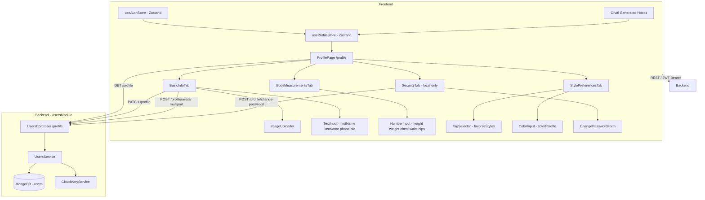
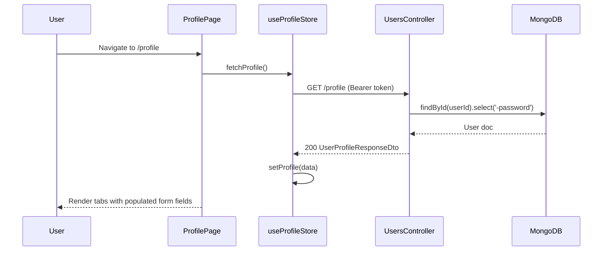
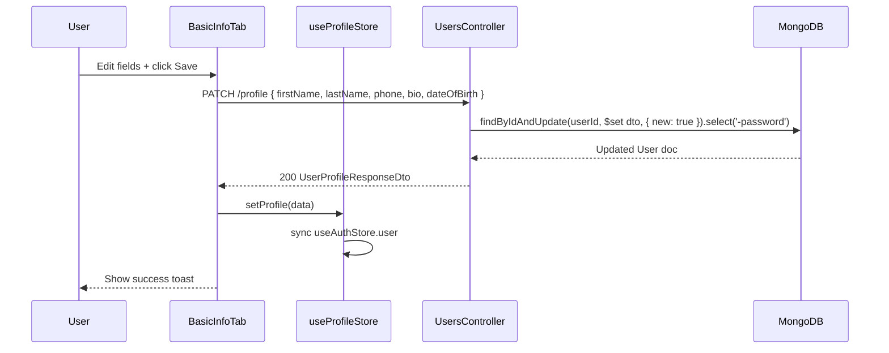
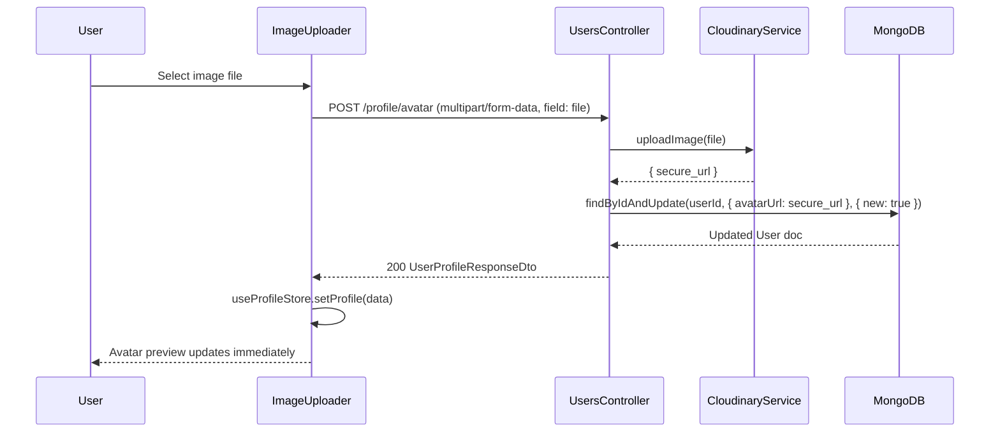

# Design Document: User Profile Management

## Overview

User Profile Management allows authenticated users to view and update their personal information, body measurements, style preferences, and avatar. It also provides a secure password change flow for local accounts. The backend is already implemented in `back-end/src/users/` with four endpoints under `/profile`; this spec formalises the full contract, identifies the Swagger/DTO gaps that block Orval type generation, and defines the complete frontend integration layer.

The frontend exposes a single `ProfilePage` at `/profile` with four tabs (Basic Info, Body Measurements, Style Preferences, Security). Each tab maps to a distinct section of the `UpdateProfileDto` or the `ChangePasswordDto`. Avatar upload is handled via `POST /profile/avatar` (multipart/form-data → Cloudinary). The Security tab is conditionally rendered only for `provider === 'local'` users. Global profile state is managed via a Zustand `useProfileStore` that stays in sync with `useAuthStore`.

---

## Architecture



---

## Sequence Diagrams

### Load Profile Page



### Update Profile (PATCH)



### Avatar Upload



### Change Password

```mermaid
sequenceDiagram
    participant U as User
    participant FE as SecurityTab
    participant BE as UsersController
    participant DB as MongoDB

    U->>FE: Fill oldPassword + newPassword + confirmPassword
    FE->>FE: Validate confirmPassword === newPassword (client-side)
    FE->>BE: POST /profile/change-password { oldPassword, newPassword }
    BE->>DB: findById(userId)
    DB-->>BE: User doc (with password hash)
    BE->>BE: bcrypt.compare(oldPassword, user.password)
    alt old password correct
        BE->>DB: user.password = bcrypt.hash(newPassword, 10); save()
        BE-->>FE: 200 { message: 'Password changed successfully' }
        FE-->>U: Show success toast, clear form
    else old password wrong
        BE-->>FE: 401 { message: 'Old password is incorrect' }
        FE-->>U: Show inline error on oldPassword field
    end
```

---

## Components and Interfaces

### Backend

#### UsersController — `/profile`

| Method | Endpoint | Guard | Description |
|--------|----------|-------|-------------|
| GET | `/profile` | JwtAuthGuard | Return current user profile (password excluded) |
| PATCH | `/profile` | JwtAuthGuard | Update profile fields (partial update) |
| POST | `/profile/avatar` | JwtAuthGuard | Upload avatar via Cloudinary (multipart/form-data) |
| POST | `/profile/change-password` | JwtAuthGuard | Change password; 401 if old password wrong |

#### UsersService

```typescript
interface UsersService {
  getProfile(userId: string): Promise<User>                          // 404 if not found; password excluded
  updateProfile(userId: string, dto: UpdateProfileDto): Promise<User>  // partial $set; password excluded
  updateAvatar(userId: string, avatarUrl: string): Promise<User>     // sets avatarUrl; password excluded
  changePassword(userId: string, dto: ChangePasswordDto): Promise<void>  // 401 if old password wrong
}
```

### Frontend

#### Pages

| Component | Route | Description |
|-----------|-------|-------------|
| `ProfilePage` | `/profile` | Tab container; fetches profile on mount |

#### Tab Components

| Component | Tab Label | Description |
|-----------|-----------|-------------|
| `BasicInfoTab` | Basic Info | Avatar upload + firstName, lastName, phone, dateOfBirth, bio |
| `BodyMeasurementsTab` | Body Measurements | height, weight, chest, waist, hips (number inputs) |
| `StylePreferencesTab` | Style Preferences | favoriteStyles (tag multi-select), colorPalette (hex inputs) |
| `SecurityTab` | Security | Change password form; only rendered when `provider === 'local'` |

#### Zustand Store: `useProfileStore`

```typescript
interface ProfileState {
  profile: UserProfileResponseDto | null
  isLoading: boolean
  fetchProfile: () => Promise<void>
  setProfile: (profile: UserProfileResponseDto) => void
}
```

---

## Data Models

### User Schema (existing — no changes)

```typescript
// back-end/src/users/user.schema.ts — already implemented
interface User {
  _id: ObjectId
  email: string                              // unique, required
  password: string                           // bcrypt hash; excluded from all profile responses
  firstName?: string
  lastName?: string
  phone?: string
  dateOfBirth?: Date
  bio?: string
  avatarUrl?: string
  measurements?: {
    height?: number    // cm, 0–300
    weight?: number    // kg, 0–500
    chest?: number     // cm, min 0
    waist?: number     // cm, min 0
    hips?: number      // cm, min 0
  }
  stylePreferences?: {
    favoriteStyles: string[]   // e.g. ['Casual', 'Streetwear']
    colorPalette: string[]     // hex strings e.g. ['#FFFFFF', '#000000']
  }
  isActive: boolean
  provider: 'local' | 'google' | 'facebook'
  createdAt: Date
  updatedAt: Date
}
```

No schema changes required.

### DTOs

**UserProfileResponseDto** ← gap: must be created for Orval type generation

```typescript
class BodyMeasurementsDto {
  height?: number
  weight?: number
  chest?: number
  waist?: number
  hips?: number
}

class StylePreferencesDto {
  favoriteStyles: string[]
  colorPalette: string[]
}

class UserProfileResponseDto {
  _id: string
  email: string
  firstName?: string
  lastName?: string
  phone?: string
  dateOfBirth?: string        // ISO date string
  bio?: string
  avatarUrl?: string
  measurements?: BodyMeasurementsDto
  stylePreferences?: StylePreferencesDto
  isActive: boolean
  provider: 'local' | 'google' | 'facebook'
  createdAt: string
  updatedAt: string
}
```

**UpdateProfileDto** (existing — no changes)

```typescript
class UpdateProfileDto {
  firstName?: string
  lastName?: string
  phone?: string
  dateOfBirth?: string        // ISO date string
  bio?: string
  measurements?: UpdateBodyMeasurementsDto
  stylePreferences?: UpdateStylePreferencesDto
}
```

**ChangePasswordDto** (existing — no changes)

```typescript
class ChangePasswordDto {
  oldPassword: string
  newPassword: string         // min 6 chars
}
```

**AvatarUploadDto** ← gap: needed for Swagger `@ApiBody` on `POST /profile/avatar`

```typescript
class AvatarUploadDto {
  file: Express.Multer.File   // multipart/form-data field name: 'file'
}
```

---

## Error Handling

### Profile Not Found
- Condition: `userId` from JWT does not match any document in `users` collection
- Response: `404 NotFoundException` — `{ message: 'User not found' }`
- Frontend: Show error toast; this should not occur in normal flow (token implies user exists)

### Wrong Old Password
- Condition: `POST /profile/change-password` — `bcrypt.compare(oldPassword, user.password)` returns `false`
- Response: `401 UnauthorizedException` — `{ message: 'Old password is incorrect' }`
- Frontend: Show inline error under `oldPassword` field; do not clear the field

### Avatar Upload Failure
- Condition: Cloudinary upload fails (network error, invalid file type, file too large)
- Response: `500` or Cloudinary-specific error propagated
- Frontend: Show error toast; revert avatar preview to previous value

### Social User Attempts Password Change
- Condition: `provider !== 'local'` user navigates directly to the Security tab
- Frontend: The Security tab is not rendered for non-local users; no backend guard needed (but the endpoint will still fail gracefully since social users have an unusable random password hash)

### Validation Errors
- Condition: DTO validation fails (e.g., `dateOfBirth` not a valid ISO date string, measurement value out of range)
- Response: `400 BadRequestException` — `{ message: [...validation errors] }`
- Frontend: Display field-level errors from the response

---

## Testing Strategy

### Unit Testing
- `UsersService.getProfile`: mock `userModel.findById` returning null → expect `NotFoundException`
- `UsersService.updateProfile`: mock `userModel.findByIdAndUpdate` returning null → expect `NotFoundException`
- `UsersService.changePassword`: mock `bcrypt.compare` returning `false` → expect `UnauthorizedException`
- `UsersService.changePassword`: mock `bcrypt.compare` returning `true` → expect `user.save()` called with new hash

### Property-Based Testing
- Library: `fast-check`
- Property: For any `UpdateProfileDto` with valid field values, `updateProfile()` always returns a user document without a `password` field
- Property: For any `ChangePasswordDto` where `bcrypt.compare` returns `false`, `changePassword()` always throws `UnauthorizedException`

### Integration Testing
- `GET /profile` with valid token → `200 UserProfileResponseDto` (no `password` field)
- `PATCH /profile` with partial body → `200` with only updated fields changed
- `POST /profile/avatar` with valid image → `200` with updated `avatarUrl`
- `POST /profile/change-password` with correct old password → `200`
- `POST /profile/change-password` with wrong old password → `401`

---

## Security Considerations

- All `/profile` endpoints require `JwtAuthGuard` — unauthenticated requests return `401`
- `password` field is always excluded from profile responses via `.select('-password')`
- Password changes require the current password — no unauthenticated reset via this endpoint
- Avatar files are uploaded directly to Cloudinary; no raw file data is stored in MongoDB
- `@CurrentUser()` decorator extracts `userId` from the validated JWT payload — no user-supplied ID is trusted

---

## Dependencies

All dependencies are already installed:
- Backend: `@nestjs/mongoose`, `mongoose`, `bcryptjs`, `@nestjs/swagger`, `class-validator`, `class-transformer`, `cloudinary`, `multer`
- Frontend: Orval (generates hooks from Swagger), Zustand, React Router v6, Tailwind CSS
